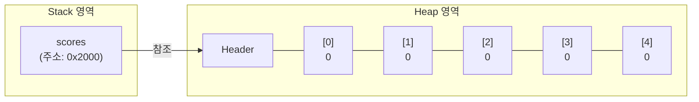
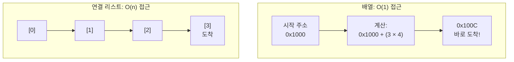
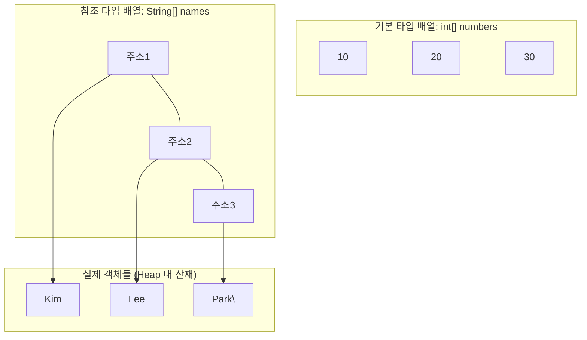
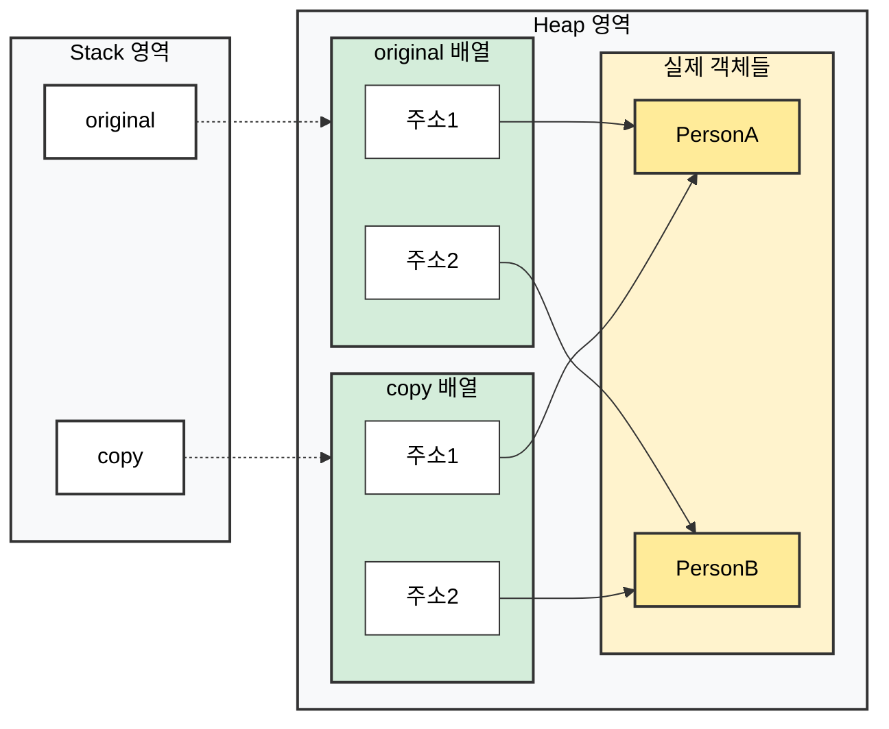
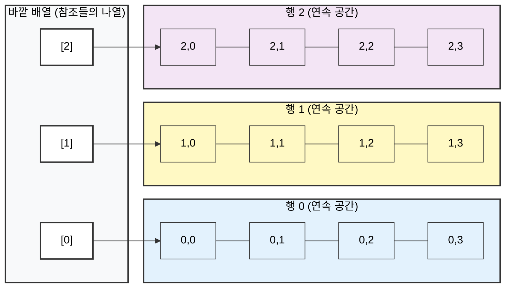

# 📑 자바 자료구조 학습 노트

## 1. 배열의 본질

> ### 📌 핵심 질문: "왜 배열이 필요한가?"

컴퓨터 메모리를 아파트 건물이라고 가정한다. 각 방(바이트)에는 고유한 호수(주소)가 배정되어 있다. 데이터를 저장하는 행위는 빈 방에 물건을 넣는 것과 같다.

### 🏢 방식 1: 개별 변수 사용 (흩어진 방)

친구 5명의 점수를 저장하기 위해 각 점수마다 별도의 변수를 선언하는 방식이다.

```java
int score1 = 85;
int score2 = 90;
int score3 = 78;
int score4 = 92;
int score5 = 88;
```

**이 방식에는 세 가지 심각한 문제가 존재한다.**

1. 코드의 중복: 데이터가 100개라면 변수를 100개 선언해야 하는 비효율이 발생한다.

2. 반복 처리 불가: 평균을 구할 때 (score1 + score2 + ... + score100) / 100.0과 같이 모든 변수를 일일이 나열해야 하므로 유지보수가 어렵다.

3. 동적 접근 불가: "N번째 친구의 점수를 출력하라"는 요청을 프로그램적으로 처리하기 어렵다. scoreN이라는 변수 이름은 소스 코드에 고정되어 있기 때문이다.

### 🏠 방식 2: 배열 사용 (연속된 예약)

배열은 연속된 메모리 공간을 한 덩어리로 예약하여 앞선 문제들을 해결한다.

```java
int[] scores = {85, 90, 78, 92, 88};
```

**배열을 도입함으로써 얻는 이점은 다음과 같다.**

- 관리 효율: 데이터의 양에 관계없이 변수명 하나(scores)로 모든 데이터를 관리할 수 있다.

- 반복문 활용: for문 등의 반복문을 사용하여 수많은 데이터를 단 몇 줄의 코드로 처리 가능하다.

- 인덱스 접근: 정수로 된 위치 정보인 '인덱스'를 통해 원하는 데이터에 즉시 접근할 수 있다.

```java
// 모든 점수의 합과 평균 구하기
int sum = 0;
for(
int i = 0;
i<scores.length;i++){
sum +=scores[i];
	}

double average = sum / (double)scores.length;
```

### 💡 핵심 원리: 임의 접근(Random Access)

배열은 특정 층의 연속된 방을 사전에 통째로 빌려두는 것과 같다. 데이터를 찾기 위해 전체 주소록을 뒤질 필요 없이 시작 위치만 기억하면 된다.

**상황**: 시작 호수가 `101호`일 때, 세 번째 데이터(인덱스 2)의 위치는?

**계산**:

```
101(시작 호수) + 2(인덱스) = 103호
```

이처럼 산술 연산만으로 위치를 파악하는 것이 배열의 본질이다. 이러한 특성 덕분에 배열은 데이터 양에 상관없이 **O(1)** 이라는 매우 빠른 조회 속도를 보장한다.

---

## 2. 메모리 구조

> ### 📌 핵심 질문: "배열은 메모리에 어떻게 저장되는가?"

### 🏠 Conceptual Essence

Java에서 `int[] scores = new int[5];`를 실행하면 JVM 내부에서 두 가지 일이 동시에 일어난다.

### 1. Stack 영역 (참조 변수 생성)

`scores`라는 참조 변수가 생성된다. 이 변수는 실제 데이터를 담는 것이 아니라, Heap에 있는 배열 객체의 주소만 저장한다.

**비유**: 마치 아파트 주소가 적힌 메모지와 같다. 메모지 자체는 아파트가 아니지만, 그 주소를 따라가면 실제 아파트를 찾을 수 있다.

### 2. Heap 영역 (실제 데이터 저장)

실제 배열 데이터가 저장된다. 중요한 점은 5개의 `int` 값이 **연속된 메모리 공간**에 나란히 배치된다는 것이다.

`int`는 4바이트이므로, 총 20바이트가 끊김 없이 이어져 있다.

### 🔍 Deep Dive



Stack에 있는 `scores` 변수는 화살표 하나, 즉 주소 하나만 들고 있다. 실제 데이터 5개는 전부 Heap에 있고, 그것들이 물리적으로 붙어 있다는 것이 핵심이다.

### 개별 변수 vs 배열

앞서 배열의 본질에서 언급했던 개별 변수 방식(`score1`, `score2`...)과 비교하면 차이가 명확해진다.

**개별 변수의 경우**: JVM이 메모리의 빈 공간을 찾아 제각각 배치한다. 101호, 305호, 512호처럼 흩어질 수 있다.

**배열의 경우**: 처음부터 "5개짜리 연속 공간을 확보해달라"고 요청하는 것이다. 101호부터 105호까지 한 줄로 예약하는 셈이다.

---

## 3. O(1) 접근의 비밀

> ### 📌 핵심 질문: "왜 배열은 크기와 상관없이 즉시 접근이 가능한가?"

### 🏠 Conceptual Essence

요소의 주소를 찾는 공식은 `시작 주소 + (인덱스 × 요소 크기)`이다.

이 공식이 강력한 이유는 계산에 필요한 연산 횟수가 배열의 전체 크기와 완전히 무관하기 때문이다.

배열에 데이터가 5개가 있든 500만 개가 있든, `arr[3]`을 찾기 위해 수행하는 연산은 곱셈 한 번, 덧셈 한 번으로 동일하다. 이를 시간 복잡도로 **O(1)**, 즉 **상수 시간(Constant
Time)** 이라고 부른다.

### 📚 도서관 비유

**배열 (O(1))**: "3번 책장의 7번째 책을 주세요."

책이 규칙적으로 정렬되어 있다면 도서관의 규모와 상관없이 즉시 해당 위치로 이동할 수 있다.

**연결 리스트 (O(n))**: 책들이 흩어져 있고 "다음 책은 저기 있어요"라는 메모만 있다면, 7번째 책을 찾기 위해 1번부터 6번까지 메모를 확인하며 이동해야 한다. 책이 많아질수록 찾는 시간도 비례해서
늘어난다.

### 🔍 Deep Dive



배열은 목적지 주소를 산술 연산으로 계산하여 단번에 도착한다.

반면 연결 리스트는 처음부터 노드를 하나씩 거쳐야 하므로, 인덱스가 커질수록 탐색 시간이 정비례하게 증가한다.

### 실제 성능 차이

1,000만 개의 요소가 있는 자료구조에서 마지막 요소를 찾을 때:

- **배열**: 여전히 곱셈 1회, 덧셈 1회로 끝난다.
- **연결 리스트**: 최악의 경우 9,999,999번의 참조 이동이 필요하다.

---

## 4. 기본 타입 vs 참조 타입 배열

> ### 📌 핵심 질문: "int[]와 String[]은 메모리에 어떻게 다르게 저장되는가?"

### 🏠 Conceptual Essence

Java에서 배열은 담기는 데이터의 종류에 따라 메모리 구성 방식이 근본적으로 다르다.

### 1. 기본 타입 배열 (`int[]`, `double[]` 등)

`int[] numbers = {10, 20, 30};`과 같이 선언하면 Heap 영역에 실제 값(Literal)들이 연속적으로 저장된다. 데이터 자체가 물리적으로 나란히 붙어 있는 구조다.

### 2. 참조 타입 배열 (`String[]`, `Object[]` 등)

`String[] names = {"Kim", "Lee", "Park"};`의 경우, 배열 공간에는 문자열 자체가 저장되지 않는다. 대신 각 문자열 객체가 위치한 **메모리 주소(참조값)** 가 저장된다.

실제 데이터인 객체들은 Heap 영역 여기저기에 흩어져 있고, 배열은 그곳을 가리키는 '이정표'들을 연속으로 들고 있는 셈이다.

### 🔍 Deep Dive



### 접근 방식의 차이와 성능적 함의

**접근 단계**: 두 방식 모두 인덱스를 통해 배열 요소에 접근하는 시간 복잡도는 **O(1)** 이다. 하지만 참조 타입 배열은 찾아간 곳에 데이터가 아닌 '주소'가 있으므로, 실제 데이터에 도달하기 위해 한 번
더 메모리 점프가 발생한다.

**캐시 효율성 (Cache Locality)**: CPU는 데이터를 읽을 때 인접한 데이터를 미리 가져온다(Spatial Locality). 기본 타입 배열은 데이터가 다닥다닥 붙어 있어 캐시 적중률이 높지만,
참조 타입 배열은 실제 객체들이 흩어져 있어 CPU가 매번 새로운 메모리 위치를 뒤져야 하므로 상대적으로 성능 손실이 발생할 수 있다.

---

## 5. 배열 복사

> ### 📌 핵심 질문: "배열을 복사할 때 무슨 일이 일어나는가?"

### 🏠 Conceptual Essence

배열은 한 번 크기가 정해지면 변경할 수 없는 정적 자료구조다. 따라서 배열을 확장하려면 더 큰 배열을 새로 생성하고, 기존 데이터를 일일이 옮겨 담아야 한다. 이 과정은 향후 `ArrayList`의 가변 크기
원리를 이해하는 데 필수적인 지식이다.

가장 기본적인 복사 방법은 `for`문을 사용하여 요소를 하나씩 대입하는 것이다.

```java
int[] original = {1, 2, 3, 4, 5};
int[] copy = new int[original.length];

for(
int i = 0;
i<original.length;i++){
copy[i]=original[i];
	}
```

이 방식은 배열 크기 n에 비례하여 시간이 걸리는 **O(n)** 연산이다. 데이터가 많아질수록 반복 횟수가 정비례하여 증가한다.

### 🔍 Deep Dive

### 1. 고속 복사: System.arraycopy()

Java는 더 효율적인 복사를 위해 `System.arraycopy()`를 제공한다. 이는 Native 메서드로, 운영체제 레벨에서 메모리 블록 전체를 통째로 복사한다. 낱장으로 책을 복사하는 대신 기계로 한 번에
찍어내는 것과 같은 효율을 보여준다.

```java
// 원본 배열, 시작 위치, 대상 배열, 시작 위치, 복사할 개수
System.arraycopy(original, 0,copy, 0,original.length);
```

### 2. 편의성: Arrays.copyOf()

`Arrays.copyOf()`는 새 배열 생성과 복사를 한 번에 처리해 주는 메서드다. 내부적으로는 `System.arraycopy()`를 호출한다.

```java
int[] original = {1, 2, 3, 4, 5};
// 크기를 늘리면서 복사 가능
int[] expanded = Arrays.copyOf(original, 10);
// 결과: {1, 2, 3, 4, 5, 0, 0, 0, 0, 0}
```

### 3. 주의사항: 얕은 복사 (Shallow Copy)

참조 타입 배열을 복사할 때는 객체 자체가 복제되는 것이 아니라 객체의 주소값만 복사된다. 이를 얕은 복사라고 한다.



---

## 6. 다차원 배열과 캐시 지역성

> ### 📌 핵심 질문: "왜 같은 O(n) 연산인데 실제 실행 속도는 크게 다를 수 있는가?"

### 🏠 Conceptual Essence

시간 복잡도($Big-O$)는 알고리즘의 논리적 효율성을 설명하지만, 하드웨어 레벨의 실제 성능을 모두 대변하지는 못한다. 이론상 같은 $O(n²)$ 이라도 실행 시간이 수 배 이상 차이 날 수 있는 비밀은 
**CPU 캐시(Cache)** 에 있다.

CPU는 메모리(RAM)보다 훨씬 빠르기 때문에, 효율을 높이려고 데이터를 가져올 때 주변 데이터까지 묶어서 캐시에 올려둔다. **이를 지역성(Locality) 원리라고 한다.**

**캐시 히트(Cache Hit)**: 필요한 데이터가 이미 캐시에 있어 즉시 처리되는 상태 (매우 빠름).

**캐시 미스(Cache Miss)**: 캐시에 데이터가 없어 느린 메모리까지 다시 다녀와야 하는 상태 (상대적으로 느림).

배열은 데이터가 물리적으로 연속되어 있어 이 캐시 히트율이 매우 높다.

### 🔍 Deep Dive

Java에서 다차원 배열은 '배열의 배열' 구조를 가진다. `int[][] matrix = new int[3][4]`를 생성하면 바깥 배열은 내부 배열들의 주소값을 들고 있고, 각 행(Row)은 메모리의 서로 다른
지점에 할당될 수 있다.

### 다차원 배열의 메모리 구조



각 행 내부의 요소들은 물리적으로 인접해 있어 캐시 효율이 좋지만, 행과 행 사이는 연속성이 보장되지 않는다. 따라서 '행 우선 순회'를 하느냐 '열 우선 순회'를 하느냐에 따라 성능 차이가 발생한다.

### 💻 실전 연습: 성능 측정 코드

CPU 캐시가 성능에 미치는 영향을 직접 확인하기 위해 아래 경로에 클래스를 생성하고 코드를 작성한다.

**파일 위치**: `src/datastructure/phase01/array/CacheLocalityDemo.java`

**패키지**: `package datastructure.phase01.array;`

### 구현 시 체크포인트

1. **행 우선 순회(Row-major)**: `matrix[i][j]` 순서로 접근하여 메모리 인접 데이터를 활용한다.

2. **열 우선 순회(Column-major)**: `matrix[j][i]` 순서로 접근하여 강제로 메모리 점프를 유도한다.

3. **성능 측정**: 두 방식의 실행 시간을 `System.currentTimeMillis()`로 측정하여 비교한다.