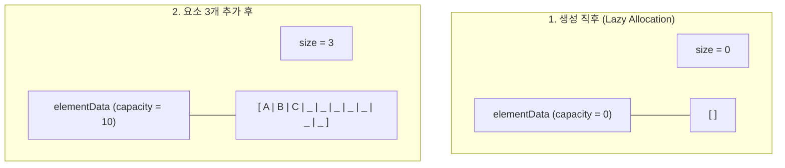
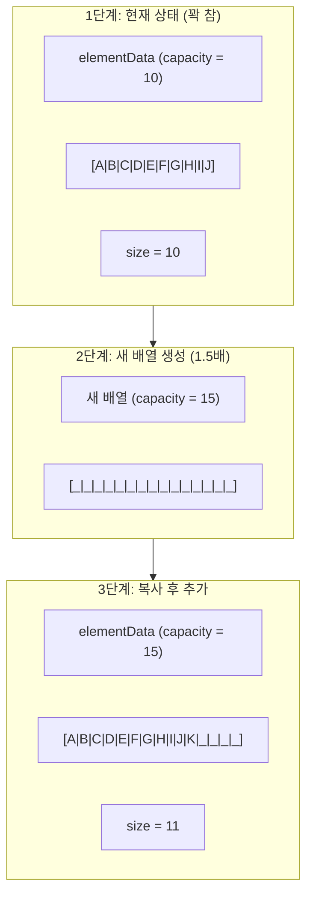
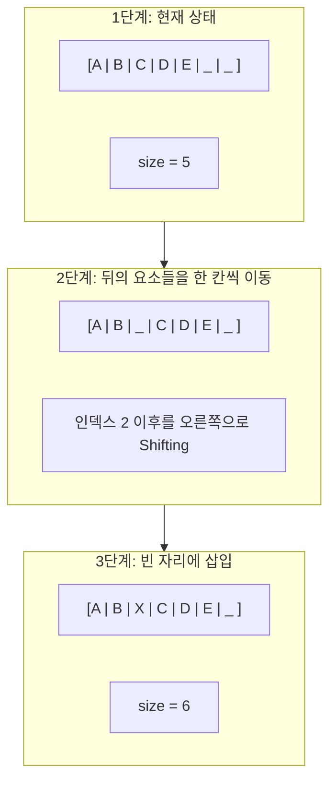

# 📑 자바 자료구조 학습 노트

## 목차
1. [ArrayList의 본질](#1-arraylist의-본질)
2. [내부 구조](#2-내부-구조)
3. [grow() 메커니즘](#3-grow-메커니즘)
4. [삽입과 삭제](#4-삽입과-삭제)
5. [초기 용량 전략](#5-초기-용량-전략)
6. [총정리 요약](#-phase-1-2-arraylist-총정리-요약)

---

## 1. ArrayList의 본질

> ### 📌 핵심 질문: "동적 배열이란 무엇인가?"

### 🏠 Conceptual Essence

배열의 가장 큰 한계는 **크기가 고정(Fixed Size)** 되어 있다는 점이다. 생성 시점에 크기를 정해야 하고, 나중에 바꿀 수 없다. 하지만 현실에서는 데이터가 얼마나 들어올지 미리 알기 어려운 경우가
많다. 사용자가 몇 개의 상품을 장바구니에 담을지, 로그가 몇 줄이나 쌓일지 예측할 수 없기 때문이다.

`ArrayList`는 이 문제를 해결한다. 사용자가 보기에는 크기 제한 없이 데이터를 계속 추가할 수 있는 **동적 배열(Dynamic Array)** 처럼 동작한다. 하지만 내부적으로 마법은 없다.
`ArrayList`의 안에는 여전히 우리가 배운 고정 크기 배열이 숨어 있다. 다만 그 배열이 가득 차면 더 큰 배열을 새로 만들고 데이터를 복사하는 작업을 내부에서 자동으로 수행할 뿐이다.

### 📝 노트 비유

노트에 메모를 하고 있는데 페이지가 다 찼다고 가정한다. 그러면 더 큰 노트를 새로 사서, 기존 내용을 전부 옮겨 적고, 새 노트에 이어서 메모를 할 것이다. `ArrayList`가 하는 일이 정확히 이것이다.
개발자가 수동으로 해야 할 귀찮은 배열 확장 작업을 객체 내부에서 대신 처리해 주는 것이다.

### 🔍 Deep Dive

### 배열(Array) vs ArrayList의 철학적 차이

**배열**: "나는 딱 10칸만 필요해." → 메모리 관리의 주도권이 개발자에게 있다.

**ArrayList**: "데이터를 계속 넣을 테니, 공간은 네가 알아서 관리해." → 메모리 관리의 주도권이 **자료구조(객체)** 에게 있다.

이러한 특성 덕분에 `ArrayList`는 자바에서 가장 많이 사용되는 자료구조가 되었다. 하지만 "자동으로 해준다"는 말 뒤에는 항상 **성능상의 비용(배열 복사 등)** 이 숨어 있다는 사실을 인지해야 한다.

---

## 2. 내부 구조

> ### 📌 핵심 질문: "elementData와 size는 어떻게 동작하는가?"

### 🏠 Conceptual Essence

`ArrayList`의 내부 소스코드를 분석하면 두 가지 핵심 필드가 이 자료구조를 지탱하고 있음을 알 수 있다. 바로 **`elementData`** 와 **`size`** 다.

### 1. `elementData` (저장소)

실제 데이터가 담기는 `Object[]` 배열이다. 이 배열의 물리적 길이가 `ArrayList`의 **용량(Capacity)** 이 된다. `Object` 타입이기에 자바의 모든 객체를 수용할 수 있다.

### 2. `size` (상태)

현재 `ArrayList`에 실제로 저장된 요소의 개수를 나타낸다.

### 🚗 주차장 비유

`elementData`가 10칸짜리 주차장 건물의 전체 크기라면, `size`는 현재 주차된 차량의 대수와 같다. 주차장(용량)은 10칸이지만, 실제로 주차된 차(사이즈)는 3대일 수 있다. 즉, `size`는
항상 `elementData.length`보다 작거나 같다.

```java
// ArrayList 내부 구조 단순화
public class ArrayList<E> {
	Object[] elementData;  // 실제 데이터 저장소 (용량)
	int size;              // 현재 유효 데이터 개수 (크기)
}
```

### 🔍 Deep Dive

### 시각화: 생성 및 요소 추가



### 지연 할당(Lazy Allocation) 전략

`new ArrayList<>()`를 호출하는 시점에는 메모리 낭비를 방지하기 위해 빈 배열을 할당한다.  
실제로 첫 번째 데이터가 `add()` 되는 순간, 자바의 기본 설정값인 `DEFAULT_CAPACITY` (10) 크기의 배열이 비로소 생성된다. 이는 메모리 효율을 극대화하기 위한 설계다.

---

## 3. grow() 메커니즘

> ### 📌 핵심 질문: "용량이 부족하면 어떻게 확장하는가?"

### 🏠 Conceptual Essence

`ArrayList`에 요소를 추가하려는데 `size == elementData.length`인 상황, 즉 배열이 꽉 찬 상황이 되면 내부적으로 `grow()` 메서드가 호출된다. 이 메서드는 더 큰 배열을 만들고,
기존 데이터를 복사한 뒤, 새 배열로 교체하는 작업을 수행한다.

가장 중요한 포인트는 **"얼마나 크게 만드는가"** 이다. 자바의 ArrayList는 기존 용량의 1.5배로 늘린다.

수식으로 표현하면 다음과 같다.

```
newCapacity = oldCapacity + (oldCapacity >> 1)
```

`>> 1`은 비트 연산자로 값을 오른쪽으로 한 칸 민다는 뜻이며, 이는 2로 나누는 것과 같다. 결과적으로 `기존 용량 + 기존 용량의 0.5배 = 1.5배`가 된다.

### 💡 왜 1.5배인가? (분할 상환 분석)

데이터를 추가할 때마다 공간을 1칸씩 늘린다면, 추가할 때마다 배열 전체를 복사해야 하므로 총 복사 비용이 $O(n^2)$이 된다. 하지만 1.5배씩 기하급수적으로 늘리면 복사 빈도가 급격히 줄어든다. 덕분에 $n$
개를 추가하는 총 비용은 $O(n)$이 되고, 개별 추가 연산의 **평균 시간 복잡도는 $O(1)$** 으로 유지될 수 있다.

### 🔍 Deep Dive

### 시각화: 1.5배 확장 과정



이 과정에서 `Arrays.copyOf()`가 사용되며, 내부적으로는 **`System.arraycopy()`** 가 호출된다. 앞서 배운 대로 Native 레벨에서 메모리 블록을 통째로 복사하기 때문에 매우
효율적이다.

### 실제 코드의 단순화 버전

```java
private void grow(int minCapacity) {
	int oldCapacity = elementData.length;

	// 비트 연산을 이용한 1.5배 계산 (나눗셈보다 빠름)
	int newCapacity = oldCapacity + (oldCapacity >> 1);

	// 새 배열 생성 및 데이터 복사 (Native 복사 활용)
	elementData = Arrays.copyOf(elementData, newCapacity);
}
```

---

## 4. 삽입과 삭제

> ### 📌 핵심 질문: "중간 삽입/삭제 시 무슨 일이 일어나는가?"

### 🏠 Conceptual Essence

`ArrayList`의 끝에 요소를 추가하는 것은 비어 있는 칸에 데이터를 넣기만 하면 되므로 매우 간단하다. 하지만 중간에 삽입하거나 삭제할 때는 배열의 본질인 연속성을 유지하기 위해 추가적인 작업이 필요하다.

중간에 요소를 끼워 넣으려면 해당 위치부터 뒤에 있는 모든 요소를 한 칸씩 뒤로 밀어야 한다. 반대로 요소를 삭제하면 중간에 빈 구멍이 생기는데, 배열은 중간에 빈틈이 있으면 안 되므로 뒤의 요소들을 모두 한 칸씩
앞으로 당겨와야 한다.

### 📚 책장 비유

꽉 찬 책장 중간에 새로운 책 한 권을 끼워 넣는다고 상상해 보자. 그 자리를 만들기 위해서는 오른쪽에 있는 모든 책을 일일이 한 칸씩 옆으로 밀어야 한다. 책이 많을수록 이 작업은 고달파진다.

### 🔍 Deep Dive

### 시각화: 인덱스 2에 "X" 삽입 과정



이 과정에서 `C`, `D`, `E` 세 개의 요소가 이동했다. 만약 리스트에 100만 개의 데이터가 있고 맨 앞에 요소를 삽입한다면, 100만 개 전체를 한 칸씩 밀어야 한다. 이러한 이유로 중간 삽입과 삭제의
시간 복잡도는 **$O(n)$** 이 된다.

### 실제 코드의 작동 원리 (단순화)

```java
public void add(int index, E element) {
	// 1. 용량 확인 및 확장 필요 시 grow() 호출
	ensureCapacity(size + 1);

	// 2. index 이후의 요소들을 한 칸씩 뒤로 복사 (Shifting)
	// System.arraycopy(원본, 시작위치, 대상, 시작위치, 개수)
	System.arraycopy(elementData, index,
		elementData, index + 1,
		size - index);

	// 3. 확보된 빈자리에 새 요소 삽입 후 사이즈 증가
	elementData[index] = element;
	size++;
}
```

---

## 5. 초기 용량 전략

> ### 📌 핵심 질문: "왜 초기 용량 설정이 중요한가?"

### 🏠 Conceptual Essence

`ArrayList`를 사용할 때 가장 흔히 저지르는 실수 중 하나는 아무런 설정 없이 `new ArrayList<>()`로 생성하는 것이다. `Phase 1-2-3`에서 배웠듯이, 기본 생성자로 만들면 초기 용량은
`10`에서 시작하며 데이터가 늘어날 때마다 `1.5배`씩 확장(grow)된다.

만약 우리가 100만 개의 데이터를 넣을 것을 미리 알고 있다면 어떨까? 기본 생성자로 만들면 100만 개에 도달할 때까지 약 40번 이상의 배열 복사가 발생한다. 이는 CPU 자원을 낭비하고 성능을 저하시키는
원인이 된다.

### 🏗️ 건축 비유

100명이 살 아파트를 지어야 하는데, 처음에는 10인용 건물을 짓고, 사람이 늘어날 때마다 건물을 허물고 다시 15인용, 22인용... 이런 식으로 계속 새로 짓는 것과 같다. 처음부터 100인용 건물을 짓는다면
이 모든 낭비를 막을 수 있다.

### 🔍 Deep Dive

### 효율적인 생성 방법

자바는 생성자를 통해 초기 용량(Initial Capacity)을 지정할 수 있는 기능을 제공한다.

```java
// 데이터가 100만 개 들어올 것을 안다면
int expectedSize = 1_000_000;
List<String> list = new ArrayList<>(expectedSize);
```

이렇게 하면 `elementData` 배열이 처음부터 100만 칸을 확보하므로, 데이터가 다 채워질 때까지 단 한 번의 `grow()` 연산(배열 복사)도 일어나지 않는다.

### 전략적 선택의 기준

**초기 용량을 작게 잡을 때**: 메모리 사용량을 최소화해야 하고, 데이터가 얼마나 들어올지 전혀 알 수 없을 때 유리하다.

**초기 용량을 크게 잡을 때**: 데이터의 양을 대략적으로 알고 있고, 성능(속도)이 최우선일 때 유리하다. 단, 너무 크게 잡으면 빈 공간이 메모리를 낭비하게 된다.


### 💡 Mentor's Advice: 언제 초기 용량을 설정해야 하는가?

초기 용량 설정은 "알면 좋은 최적화" 정도로 생각하면 된다. 대부분의 일반적인 상황에서는 기본값으로도 충분히 잘 동작한다. 하지만 아래의 3가지 상황에서는 반드시 초기 용량 설정을 고려해야 한다.

#### 1. 데이터 개수를 미리 알 수 있는 경우

예를 들어 데이터베이스(DB)에서 조회한 결과를 담을 때, 전체 레코드 개수를 먼저 알 수 있다면 그 크기로 초기화하는 것이 훨씬 효율적이다.

#### 2. 대량의 데이터를 다루는 경우

수십만, 수백만 건의 데이터를 다룬다면 `grow()`로 인한 배열 복사 비용이 누적되어 성능 저하가 체감될 수 있다.

#### 3. 성능이 중요한 코드 경로(Hot Path)

사용자 요청을 빈번하게 처리하는 핵심 로직 내에서 불필요한 배열 복사가 일어나지 않도록 관리해야 한다.

---

# 📑 Phase 1-2: ArrayList 총정리 요약

기존의 비유를 덜어내고, 자바의 메모리 관리 원칙과 물리적 구조에 집중하여 전체 내용을 요약한다.

## 1. ArrayList의 본질 (Phase 1-2-1)

**동적 배열**: 내부적으로 고정 크기 배열을 사용하면서, 용량이 부족하면 자동으로 확장하는 자료구조다.

**메모리 관리 위임**: 개발자가 배열 크기를 직접 관리하지 않고, 자료구조가 알아서 처리한다.

## 2. 내부 구조와 성장 메커니즘 (Phase 1-2-2)

**핵심 필드**: `elementData`(실제 데이터 저장소)와 `size`(현재 요소 개수)로 구성된다.

**1.5배 확장**: 용량 초과 시 `grow()` 메서드가 기존 용량의 1.5배 크기 배열을 생성하고 데이터를 복사한다.

## 3. 삽입과 삭제의 비용 (Phase 1-2-3)

**중간 삽입/삭제 ($O(n)$)**: 연속된 메모리를 유지하기 위해 요소들을 뒤로 밀거나 앞으로 당기는 Shifting 작업이 필수적이다.

**끝 추가 (Amortized $O(1)$)**: 확장 비용이 분산되어 평균적으로 상수 시간이다.

## 4. 성능 특성과 최적화 (Phase 1-2-4)

**인덱스 접근 ($O(1)$)**: 내부적으로 배열을 사용하므로 인덱스 기반 조회는 매우 빠르다.

**캐시 지역성**: 데이터가 물리적으로 인접해 있어 CPU 캐시 히트율이 높다.

**초기 용량 설정**: 데이터 양을 예측할 수 있다면 미리 설정하여 `grow()` 비용을 줄인다.