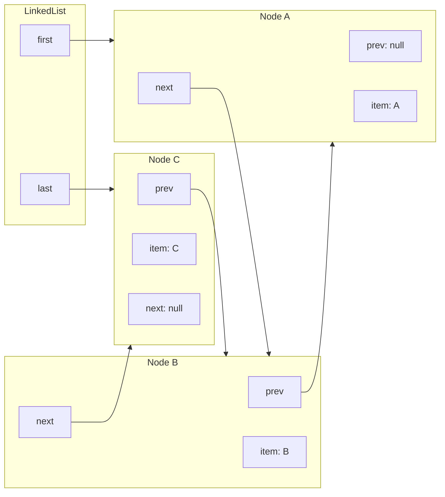
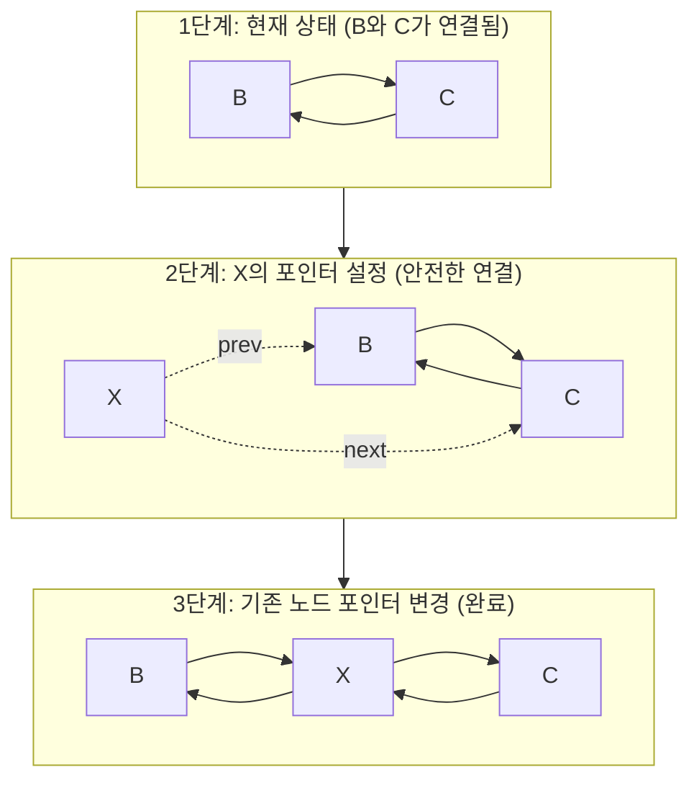
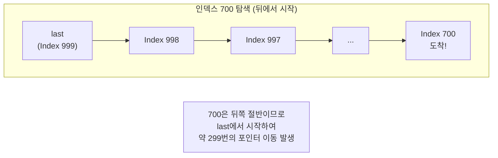
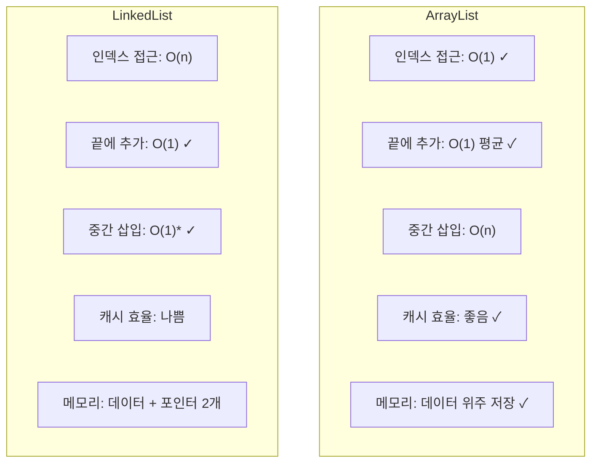

# 📑 자바 자료구조 학습 노트

## 목차
1. [LinkedList의 본질](#1-linkedlist의-본질)
2. [Node 구조](#2-node-구조)
3. [삽입과 삭제](#3-삽입과-삭제)
4. [탐색의 비용](#4-탐색의-비용)
5. [ArrayList vs LinkedList](#5-arraylist-vs-linkedlist)
6. [총정리 요약](#-phase-1-3-linkedlist-총정리-요약)

---

## 1. LinkedList의 본질

> ### 📌 핵심 질문: "연결 리스트란 무엇인가?"

### 🏠 Conceptual Essence

`ArrayList`가 데이터를 물리적으로 연속된 공간에 나란히 배치했다면, `LinkedList`는 비연속적 공간에 데이터를 자유롭게 배치하는 철학을 가진다. 각 데이터는 독립적인 공간에 존재하며, 자신이
누구인지(Data)와 **다음 데이터가 어디에 있는지(Reference)** 를 함께 기억하는 방식이다.

### 🗺️ 보물찾기 비유

보물찾기 게임을 상상해 보자. 첫 번째 쪽지에는 보물이 직접 들어있는 것이 아니라 "다음 쪽지는 도서관에 있어"라고 적혀 있다. 도서관에 가면 또 "다음 쪽지는 카페에 있어"라는 메모가 있다. 이렇게 메모(참조)를
따라가다 보면 최종 목적지에 도달하게 된다.

`LinkedList`가 바로 이런 구조다. 각 요소를 **노드(Node)** 라고 부르며, 이 노드들이 포인터(참조)로 연결되어 하나의 리스트를 형성한다.

### 🔍 Deep Dive

### 왜 이런 방식이 필요한가?

### 1. 메모리 활용의 유연성

데이터가 연속된 빈 공간을 찾아 헤맬 필요가 없다. Heap 메모리 여기저기에 남는 틈새 공간이 있다면 어디든 들어갈 수 있다.

### 2. 삽입과 삭제의 혁신

배열의 가장 큰 고통이었던 '데이터 밀기(Shifting)'가 없다. 중간에 새 요소를 넣고 싶다면, 앞쪽 요소가 가리키는 방향을 새 요소로 바꾸고, 새 요소가 기존 다음 요소를 가리키게만 하면 된다. 즉, 포인터
연결만 수정하면 끝난다.

### 구조적 특징

**노드(Node)**: 데이터와 다음 노드의 주소를 담고 있는 객체 단위.

**헤드(Head)**: 리스트의 시작점인 첫 번째 노드를 가리킨다.

**포인터(Pointer/Reference)**: 다음 노드와 연결되는 고리 역할을 한다.

---

## 2. Node 구조

> ### 📌 핵심 질문: "데이터와 포인터는 어떻게 연결되는가?"

### 🏠 Conceptual Essence

`LinkedList`의 최소 단위는 **Node(노드)** 라는 객체다. 노드는 실제 데이터인 `item`과 다른 노드의 위치를 가리키는 `참조(주소)`를 결합한 형태다.

특히 Java의 `java.util.LinkedList`는 이중 연결 리스트(Doubly Linked List) 형식을 취한다. 각 노드는 '다음 노드'뿐만 아니라 '이전 노드'의 주소도 함께 저장한다. 이 덕분에
리스트를 정방향과 역방향 모두 자유롭게 순회할 수 있다.

```java
// LinkedList 내부의 Node 클래스 (단순화 버전)
private static class Node<E> {
	E item;        // 실제 데이터
	Node<E> next;  // 다음 노드를 가리키는 참조 (포인터)
	Node<E> prev;  // 이전 노드를 가리키는 참조 (포인터)
}
```

`LinkedList` 객체 자체는 전체 리스트의 시작점인 `first`와 끝점인 `last`라는 두 개의 참조 변수를 관리하며 전체 체인을 유지한다.

### 🔍 Deep Dive

### 시각화: "A", "B", "C"가 연결된 상태



**경계 조건**: 리스트의 양 끝인 첫 번째 노드의 `prev`와 마지막 노드의 `next`는 연결할 대상이 없으므로 `null`을 가리킨다.

**메모리 배치**: `ArrayList`가 메모리라는 도화지에 선을 긋고 데이터를 채운다면, `LinkedList`는 메모리 곳곳에 점(Node)을 찍고 그 점들을 실(Pointer)로 연결한 것과 같다. 이 '
실' 때문에 실제 데이터인 `item` 외에 `prev`와 `next`를 위한 추가적인 메모리 공간이 필요하다는 점을 인지해야 한다.

---

## 3. 삽입과 삭제

> ### 📌 핵심 질문: "포인터 조작은 어떻게 이루어지는가?"

### 🏠 Conceptual Essence

`LinkedList`의 삽입과 삭제는 포인터 재연결(Pointer Re-linking) 작업이다. 데이터를 물리적으로 밀거나 당기는 `ArrayList`와 달리, 기존 노드 사이의 연결 고리를 끊고 새로운 연결을
맺어주기만 하면 된다.

이때 가장 중요한 것은 작업의 순서다. 기존 연결을 무턱대고 먼저 끊어버리면 다음 노드로 가는 주소를 잃어버려 리스트가 끊어질 수 있다. 따라서 새 노드의 방향을 먼저 정한 뒤, 기존 노드들이 새 노드를 가리키도록
업데이트하는 것이 안전하다.

### 🔍 Deep Dive

### 시각화: B와 C 사이에 X를 삽입하는 과정



### 삽입 과정 단계별 설명

**1단계**: 기존 노드 B와 C가 서로를 참조하고 있다.

**2단계**: 새 노드 X를 생성하고, X가 B와 C를 바라보게 만든다. 이때까지 B와 C는 여전히 서로를 보고 있다.

**3단계**: B의 `next`를 X로, C의 `prev`를 X로 변경한다. 이제 완벽한 B-X-C 체인이 형성된다.

삭제는 이의 반대다. X를 삭제하려면 B가 C를, C가 B를 직접 가리키게 포인터를 건너뛰어 연결하면 된다. 고립된 X는 Java의 가비지 컬렉터(GC)가 자동으로 수거한다.

### 실제 코드의 작동 원리 (단순화)

```java
// B와 C 사이에 X를 삽입하는 로직
void insertBetween(Node<E> b, Node<E> c, E item) {
	Node<E> x = new Node<>();
	x.item = item;

	// 1. 새 노드 X의 포인터를 먼저 설정 (연결 유실 방지)
	x.prev = b;
	x.next = c;

	// 2. 기존 노드들의 포인터를 X로 전환
	if (b != null)
		b.next = x;
	if (c != null)
		c.prev = x;
}
```

---

## 4. 탐색의 비용

> ### 📌 핵심 질문: "왜 연결 리스트는 인덱스 접근이 느린가?"

### 🏠 Conceptual Essence

`ArrayList`에서 `get(500)`은 시작 주소에서 오프셋을 계산해 단번에 점프($O(1)$)하는 연산이다. 하지만 `LinkedList`는 메모리가 흩어져 있기 때문에 주소를 계산할 수 없다. 따라서 특정
인덱스에 접근하려면 반드시 첫 번째 노드(`first`)부터 시작해서 `next` 포인터를 원하는 횟수만큼 타고 들어가야 한다. 마치 보물찾기에서 500번째 쪽지를 찾기 위해 앞선 499개의 쪽지를 모두 읽어야 하는
것과 같다.

### ⚡ Java의 최적화: 양방향 탐색

Java의 `LinkedList`는 이중 연결 리스트의 장점을 살려 탐색 효율을 조금이라도 높이려 노력한다. 찾고자 하는 인덱스가 전체 크기의 앞쪽 절반이면 `first`에서, 뒤쪽 절반이면 `last`에서 역순으로
탐색을 시작한다.

```java
// LinkedList의 node(index) 메서드 (단순화 버전)
Node<E> node(int index) {
	if (index < (size >> 1)) { // 앞쪽 절반
		Node<E> x = first;
		for (int i = 0; i < index; i++)
			x = x.next;
		return x;
	} else { // 뒤쪽 절반
		Node<E> x = last;
		for (int i = size - 1; i > index; i--)
			x = x.prev;
		return x;
	}
}
```

하지만 이 최적화가 있더라도 최악의 경우 $n/2$번 이동해야 하므로, 시간 복잡도의 관점에서는 여전히 **$O(n)$** 이다.

### 🔍 Deep Dive

### 시각화: 인덱스 700 탐색 (1000개 요소 기준)



### 하드웨어의 한계: 캐시 미스(Cache Miss)

물리적인 연산 횟수보다 더 큰 문제는 **캐시 지역성(Cache Locality)** 의 부재다. 노드들이 메모리 여기저기에 파편화되어 있기 때문에, 포인터를 따라갈 때마다 CPU는 완전히 새로운 주소로 점프해야
한다. 이는 빈번한 캐시 미스를 유발하여 실제 처리 속도를 지표보다 훨씬 더 느리게 만든다.

---

## 5. ArrayList vs LinkedList

> ### 📌 핵심 질문: "언제 무엇을 선택해야 하는가?"

### 🏠 Conceptual Essence

두 자료구조는 서로 상반된 물리적 구조와 철학을 가지고 있다.

ArrayList는 연속된 공간을 점유하여 **'조회와 순차 접근'** 에 최적화되어 있고, LinkedList는 흩어진 공간을 연결하여 **'참조 변경을 통한 수정'** 에 최적화되어 있다. 하지만 현대 컴퓨팅
환경(CPU 캐시, 메모리 대역폭 등)에서는 이론적인 시간 복잡도보다 물리적인 메모리 배치가 성능에 더 큰 영향을 미친다.

### 🔍 Deep Dive

### 시각화: 두 자료구조의 특징 비교



### ⚠️ LinkedList의 숨겨진 비용

### 1. 중간 삽입 $O(1)$의 함정

삽입 자체는 $O(1)$이지만, 그 위치까지 가기 위한 탐색 비용이 $O(n)$이므로 결국 전체 연산은 $O(n)$에 가깝다. 오직 `Iterator`를 통해 이미 위치를 점유한 상태에서만 진정한 $O(1)$ 삭제/
삽입이 가능하다.

### 2. 메모리 오버헤드

각 노드마다 `prev`, `next` 포인터를 저장해야 한다. 64비트 JVM 기준, 요소마다 약 16바이트의 추가 메모리가 소모되어 대량 데이터 처리 시 메모리 낭비가 심하다.

### 3. 캐시 미스

데이터가 메모리 여기저기 흩어져 있어 CPU가 데이터를 미리 읽어오는 기능을 제대로 활용하지 못한다.

### 💡 Mentor's Advice: 실무에서의 선택 기준

실무에서 어떤 리스트를 쓸지 고민된다면 다음 원칙을 따른다.

### 1. 기본은 `ArrayList`

대부분의 경우 `ArrayList`가 조회와 순회 성능에서 압도적이다.

### 2. LinkedList를 고려하는 예외 상황

`Iterator`를 사용해 리스트를 순회하면서 특정 조건의 요소를 빈번하게 삭제해야 할 때만 고려한다.

### 3. Queue/Deque가 필요할 때

`LinkedList`가 `Queue` 인터페이스를 구현하고는 있지만, 실제 성능은 **`ArrayDeque`** 가 훨씬 빠르다. 큐 구조가 필요하면 `ArrayDeque`를 우선 사용한다.

결론적으로, Java 표준 API 문서에서도 대부분의 상황에서 `ArrayList` 사용을 권장한다.

---

# 📑 Phase 1-3: LinkedList 총정리 요약

기존의 비유를 덜어내고, 자바의 메모리 관리 원칙과 물리적 구조에 집중하여 전체 내용을 요약한다.

## 1. 연결 리스트의 본질 (Phase 1-3-1)

**철학의 변화**: 데이터를 연속된 공간에 가두지 않고, 메모리 곳곳에 자유롭게 배치한 뒤 **참조(Pointer)** 로 연결한다.

**유연성**: 데이터의 삽입과 삭제 시 물리적인 이동(Shifting)이 필요 없으며, 메모리 파편화 상황에서도 효율적으로 데이터를 저장할 수 있다.

## 2. 이중 연결 리스트와 노드 구조 (Phase 1-3-2)

**노드(Node)**: 실제 데이터(`item`)와 앞뒤 노드의 주소(`prev`, `next`)를 담고 있는 객체 단위이다.

**양방향 탐색**: Java의 `LinkedList`는 이중 연결 리스트로 구현되어 있어 앞뒤 양방향으로 순회가 가능하다.

## 3. $O(1)$ 삽입과 삭제의 메커니즘 (Phase 1-3-3)

**포인터 조작**: 삽입과 삭제는 데이터를 미는 것이 아니라 참조의 연결 고리를 수정하는 작업이다.

**효율성**: 위치를 알고 있다는 전제하에, 데이터 개수와 상관없이 포인터 몇 개만 바꾸면 연산이 완료된다($O(1)$).

## 4. 탐색의 비용과 최적화 (Phase 1-3-4)

**순차 접근(Sequential Access)**: 인덱스로 즉시 점프할 수 없으므로 처음 혹은 끝부터 포인터를 타고 이동해야 한다($O(n)$).

**성능 저하의 주범**: 노드들이 메모리에 흩어져 있어 **캐시 지역성(Cache Locality)** 이 매우 낮으며, 이는 빈번한 캐시 미스를 유발한다.

## 5. ArrayList vs LinkedList 최종 대결 (Phase 1-3-5)

**실무적 선택**: 현대 컴퓨팅 환경에서는 캐시 효율이 좋은 **`ArrayList`** 가 대부분의 상황에서 압도적으로 유리하다.

**LinkedList의 입지**: `Iterator`를 이용한 빈번한 중간 삭제나 맨 앞 삽입이 극단적으로 많은 경우를 제외하면 거의 사용되지 않는다. 큐(Queue) 구조가 필요할 때도 보통 `ArrayDeque`를 권장한다.