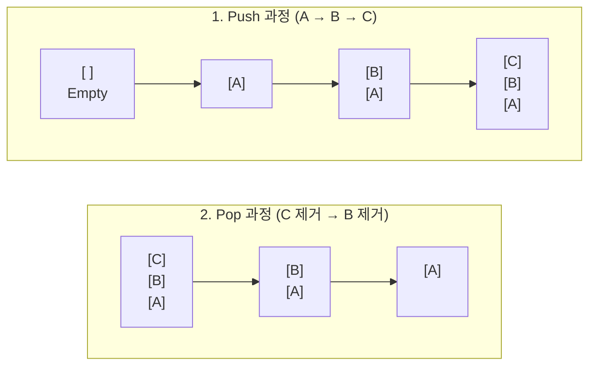
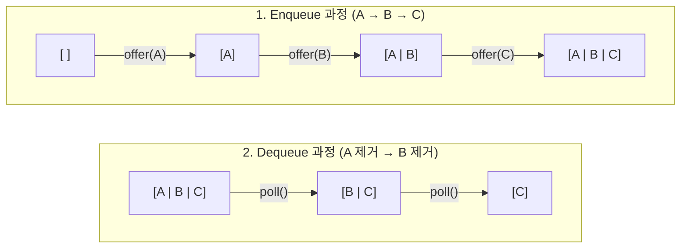
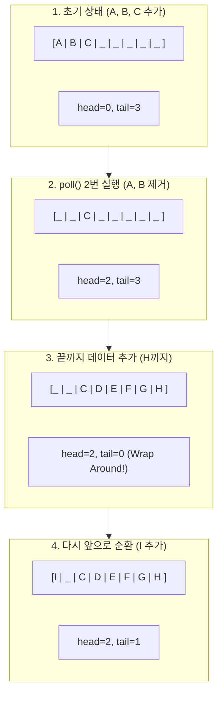
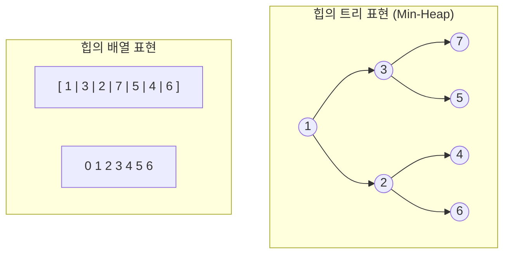

# 📑 자바 자료구조 학습 노트

## 1. Stack의 본질

> ### 📌 핵심 질문: "LIFO(Last In First Out)란 무엇인가?"

### 🏠 Conceptual Essence

Stack은 LIFO(Last In, First Out) 원리를 따르는 선형 자료구조다. "마지막에 들어온 데이터가 가장 먼저 나간다"는 의미를 담고 있다.

### 🍽️ 접시 쌓기 비유

식당에서 접시를 쌓아두는 모습을 상상해 보자. 새로운 접시는 항상 맨 위에 놓인다(Push). 반대로 접시를 가져갈 때도 맨 위에 있는 접시부터 집어 들게 된다(Pop). 맨 아래에 있는 접시를 꺼내고 싶다면 그
위에 쌓인 모든 접시를 먼저 치워야 한다. 이처럼 입구와 출구가 동일한 구조가 바로 Stack이다.

### 핵심 연산 3가지

**`push(E item)`**: 데이터의 맨 위에 요소를 추가한다.

**`pop()`**: 맨 위의 요소를 꺼내어 반환하고, 동시에 제거한다.

**`peek()`**: 맨 위의 요소가 무엇인지 확인만 하고 제거하지는 않는다.

### 🔍 Deep Dive

### 시각화: 데이터의 흐름



Stack은 오직 **맨 위(Top)** 만 다룬다. 중간에 있는 요소에 직접 접근하는 것은 Stack의 철학에 어긋나며, 이를 위해서는 위에 있는 요소들을 전부 밖으로 꺼내야만 한다.

### 💻 실전 사례: JVM Stack과 되돌리기(Undo)

이 구조는 함수 호출 관리에서 결정적인 역할을 한다. 메서드 A가 B를 호출하고, B가 C를 호출하면 메모리에는 A-B-C 순서로 쌓인다. 작업이 완료될 때는 가장 나중에 호출된 C가 먼저 끝나야 B로 돌아갈 수
있고, B가 끝나야 A로 돌아갈 수 있다. 우리가 흔히 쓰는 `Ctrl + Z` (실행 취소) 기능 역시 마지막 작업부터 역순으로 되돌리는 Stack의 원리를 이용한 것이다.

---

## 2. Java Stack의 문제점

> ### 📌 핵심 질문: "왜 Stack 클래스를 쓰면 안 되는가?"

### 🏠 Conceptual Essence

Java에는 `java.util.Stack` 클래스가 있습니다. 이름만 보면 Stack이 필요할 때 당연히 이걸 쓰면 될 것 같죠. 하지만 Java 공식 문서에서조차 이 클래스를 사용하지 말라고 권장합니다.

문제는 Stack 클래스가 `Vector`를 상속한다는 점입니다. Vector는 Java 1.0 시절에 만들어진 오래된 클래스로, 모든 메서드에 `synchronized` 키워드가 붙어 있습니다. 멀티스레드 환경에서
안전하게 만들려고 한 것인데, 이 때문에 단일 스레드 환경에서도 불필요한 동기화 비용이 발생합니다.

더 심각한 문제는 상속으로 인한 설계 오염입니다. Stack이 Vector를 상속했기 때문에, Vector의 모든 메서드가 Stack에서도 사용 가능합니다. 예를 들어 `get(index)`로 중간 요소에
접근하거나, `add(index, element)`로 중간에 삽입할 수 있습니다. 이것은 Stack의 LIFO 원칙을 완전히 무시하는 것이죠.

```java
Stack<String> stack = new Stack<>();
stack.

push("A");
stack.

push("B");
stack.

push("C");

// Stack인데 중간 요소에 접근 가능 - 설계적으로 잘못됨
String middle = stack.get(1);  // "B" 반환
stack.

add(0,"X");  // 맨 아래에 삽입 가능
```

### 🔍 Deep Dive

### 올바른 대안: Deque 인터페이스

올바른 대안은 `Deque` 인터페이스를 사용하는 것입니다. Deque는 "Double Ended Queue"의 약자로, 양쪽 끝에서 추가/삭제가 가능한 자료구조입니다. 이 중 한쪽 끝만 사용하면 Stack이
됩니다.

```java
// 권장하는 방식
Deque<String> stack = new ArrayDeque<>();
stack.

push("A");
stack.

push("B");
stack.

push("C");

String top = stack.pop();   // "C"
String peek = stack.peek(); // "B" (제거하지 않고 확인)
```

ArrayDeque는 Vector처럼 불필요한 동기화가 없고, 중간 요소 접근 메서드도 제공하지 않아서 Stack의 원칙을 지킬 수 있습니다.

### 💡 Mentor's Advice

Java의 Stack 클래스는 "상속보다 조합을 사용하라"는 객체지향 원칙을 어긴 대표적인 사례로 자주 언급됩니다. Vector를 상속하는 대신, 내부에 배열을 포함하는 방식으로 설계했어야 합니다. 이렇게 하면
Stack에 필요한 메서드만 노출하고, 나머지는 숨길 수 있었겠죠.

레거시 코드에서 Stack 클래스를 보더라도, 새로 작성하는 코드에서는 ArrayDeque를 사용하세요.

---

## 3. Queue의 본질

> ### 📌 핵심 질문: "FIFO(First In First Out)란 무엇인가?"

### 🏠 Conceptual Essence

Queue는 FIFO(First In, First Out) 원리를 따르는 선형 자료구조다. "먼저 들어온 데이터가 가장 먼저 나간다"는 의미로, 우리말로는 선입선출이라 부른다.

### ☕ 커피숍 대기줄 비유

말씀하신 대기줄이 완벽한 예시다. 커피숍에서 줄을 서면 먼저 온 손님부터 주문을 받는다. 새로 온 손님은 줄의 맨 뒤(Rear)에 서야 하고, 맨 앞(Front) 손님이 주문을 마치면 그다음 손님 차례가 된다.
새치기가 허용되지 않는 '공정함'과 '순서'가 Queue의 핵심이다.

### 핵심 연산 3가지

**`offer(E e)` (또는 `add`)**: 데이터의 맨 뒤에 요소를 추가한다.

**`poll()` (또는 `remove`)**: 맨 앞의 요소를 꺼내어 반환하고, 동시에 제거한다.

**`peek()`**: 맨 앞의 요소가 무엇인지 확인만 하고 제거하지는 않는다.

### 🔍 Deep Dive

### 시각화: 데이터의 흐름



데이터가 들어오는 곳과 나가는 곳이 분리되어 있다. 한쪽 끝(Top)에서만 입출력이 일어나는 Stack과 가장 큰 차이점이다.

### 💻 실전 사례: 작업 처리 시스템

Queue는 주로 순차적인 작업 처리가 필요한 곳에 쓰인다.

**프린터 스풀러**: 여러 문서를 출력할 때 먼저 요청한 문서부터 인쇄한다.

**프로세스 관리**: CPU 스케줄링에서 대기 중인 프로세스들을 순서대로 처리한다.

**메시지 큐**: 시스템 간 데이터를 주고받을 때 처리 속도 차이를 조절하기 위해 데이터를 순서대로 쌓아둔다.

---

## 4. PriorityQueue의 본질

> ### 📌 핵심 질문: "순서가 아닌 '가치'에 따라 데이터를 내보낼 수 있을까?"

### 🏠 Conceptual Essence

일반적인 큐가 "먼저 온 사람이 임자"인 선착순이라면, PriorityQueue는 "중요한 사람이 임자"인 구조다. 데이터가 들어온 순서와 상관없이, 우선순위가 높은 데이터가 가장 먼저 나가는 특징이 있다.

### 🏥 응급실 비유

응급실을 생각해보자. 접수한 순서대로 진료를 받는 게 원칙이지만, 갑자기 심정지 환자가 실려 온다면? 그 환자가 가장 먼저 진료실로 들어간다. 접수 순서보다 '위급함(우선순위)'이 더 중요하기 때문이다.

### 🔍 Deep Dive

### 1. 동작 원리: 힙(Heap)

PriorityQueue는 내부적으로 **힙(Heap)** 이라는 완전 이진 트리 구조를 사용한다.

**최소 힙(Min Heap)**: 작은 값이 우선순위가 높음 (Java의 기본값).

**최대 힙(Max Heap)**: 큰 값이 우선순위가 높음.

### 2. 시간 복잡도

데이터를 넣거나 뺄 때마다 정렬 상태를 유지해야 하므로 일반 큐보다 조금 더 비용이 든다.

**삽입 (`offer`)**: $O(\log n)$

**삭제 (`poll`)**: $O(\log n)$

**조회 (`peek`)**: $O(1)$ (항상 루트 노드에 가장 우선순위가 높은 놈이 있음)

### 3. 사용 시 주의사항

**Null 허용 안 함**: 우선순위를 비교해야 하는데 `null`이 있으면 비교를 못 해서 에러가 난다.

**Comparable/Comparator 필수**: "뭐가 더 중요한지" 기준을 알려줘야 한다. 숫자면 크기순으로 하면 되지만, 커스텀 객체(예: 환자 객체)라면 나이순인지 위급도순인지 직접 정해줘야 한다.

### 💻 실전 코드 예시

```java
// 기본은 오름차순 (작은 숫자가 우선순위가 높음)
PriorityQueue<Integer> pq = new PriorityQueue<>();

pq.

offer(30);
pq.

offer(10);
pq.

offer(20);

System.out.

println(pq.poll()); // 10 (가장 작음)
	System.out.

println(pq.poll()); // 20
```

---

## 5. ArrayDeque의 본질

> ### 📌 핵심 질문: "원형 배열이란 무엇인가?"

### 🏠 Conceptual Essence

양쪽 끝에서 삽입과 삭제가 모두 가능한 자료구조를 **Deque(Double Ended Queue, 덱)** 라고 부른다. Java의 `ArrayDeque`는 이 Deque 인터페이스를 배열로 구현한 클래스다.

`ArrayList`로 큐를 만들면 맨 앞 데이터를 지울 때마다 뒤의 데이터를 전부 앞으로 당겨야 하는 **$O(n)$** 의 고통이 발생한다. `ArrayDeque`는 **원형 배열(Circular Array)**
이라는 기발한 아이디어로 이 문제를 해결하여 맨 앞/뒤 삽입·삭제를 모두 **$O(1)$** 로 처리한다.

원형 배열은 배열의 끝과 처음이 연결된 것처럼 인덱스를 순환시킨다. 시계 바늘이 12시를 지나면 다시 1시로 돌아오듯, 인덱스가 배열의 마지막 칸에 도달하면 다시 0번 칸으로 돌아가는 방식이다.

### 🔍 Deep Dive

### 1. 포인터 전략: head와 tail

`ArrayDeque`는 내부적으로 두 개의 포인터를 관리한다.

**head**: 첫 번째 요소가 있는 위치를 가리킨다.

**tail**: 새로운 요소가 추가될 빈 공간(다음 요소의 자리)을 가리킨다.

데이터를 삭제할 때 요소를 물리적으로 이동시키지 않는다. 대신 head 포인터만 한 칸 옆으로 이동시킨다. 남겨진 데이터는 무시하면 그만이다.

### 2. 시각화: 원형 배열의 순환



### 3. 나머지 연산의 마법

인덱스가 끝에서 처음으로 돌아가는 원리는 **나머지 연산(Modulo, %)** 에 있다.

```
다음 인덱스 = (현재 인덱스 + 1) % 배열의 크기
```

배열 크기가 8일 때, 인덱스 7 다음은 `(7 + 1) % 8 = 0`이 되어 자연스럽게 첫 번째 칸으로 돌아간다.

---

---

## 6. PriorityQueue의 작동 원리

> ### 📌 핵심 질문: "힙(Heap) 자료구조란 무엇인가?"

### 🏠 Conceptual Essence

`PriorityQueue`는 들어온 순서가 아니라 우선순위가 높은 순서로 나가는 큐다. 응급실 비유가 아주 정확하다. 환자가 도착한 순서가 아니라 위급한 정도에 따라 치료 순서가 결정되는 것과 같다.

이걸 어떻게 효율적으로 구현할까? 단순히 정렬된 배열을 유지하면 삽입할 때마다 제자리를 찾아 끼워 넣어야 해서 $O(n)$이 걸린다. 하지만 `PriorityQueue`는 **힙(Heap)** 이라는 구조를 사용해서
삽입과 삭제를 모두 **$O(\log n)$** 에 처리한다.

힙은 완전 이진 트리인데, 특별한 규칙이 있다. 부모는 항상 자식보다 우선순위가 높아야 한다는 점이다. Java의 `PriorityQueue`는 기본적으로 **최소 힙(Min-Heap)** 이라서, 부모가 자식보다
항상 작다. 덕분에 가장 작은 값이 항상 맨 위(루트)에 있게 된다.

### 🔍 Deep Dive

힙의 핵심은 트리 구조를 배열로 표현한다는 점이다. 완전 이진 트리는 빈틈없이 채워지기 때문에, 복잡한 포인터 없이 배열 인덱스만으로 부모-자식 관계를 계산할 수 있다.

### 시각화: 힙의 트리와 배열 표현



배열 인덱스 $i$를 기준으로 관계는 다음과 같이 계산한다:

**부모**: $(i - 1) / 2$

**왼쪽 자식**: $2 \times i + 1$

**오른쪽 자식**: $2 \times i + 2$

### 핵심 연산 메커니즘

### 1. 삽입 (Sift up)

맨 끝에 데이터를 추가하고, 부모와 비교해서 내가 더 작으면 위로 올라간다. 루트에 도달하거나 나보다 작은 부모를 만날 때까지 반복한다.

### 2. 삭제 (Sift down)

루트(최솟값)를 꺼내고, 맨 끝 요소를 루트 자리에 갖다 놓는다. 그다음 자식들 중 더 작은 놈과 비교하며 아래로 내려간다. 제자리를 찾을 때까지 반복한다.

트리의 높이가 $\log n$이기 때문에, 이 과정은 최대 **$O(\log n)$** 이면 끝난다.

### 💡 Mentor's Advice

### 1. 상위 K개 추출

100만 개 데이터 중 가장 큰 10개를 찾을 때 전체 정렬($O(n \log n)$) 대신, 크기 10짜리 힙을 유지하는 것이 훨씬 효율적이다.

### 2. 순회 주의

`PriorityQueue`를 `Iterator`나 `forEach`로 돌리면 정렬된 순서가 나오지 않는다! 힙은 "부모-자식" 간의 우선순위만 보장할 뿐, 형제 노드끼리는 정렬되어 있지 않기 때문이다. 정렬된
순서가 필요하면 무조건 `poll()`을 반복해서 꺼내야 한다.