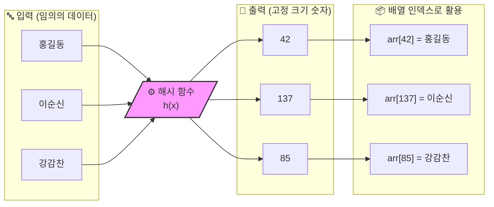
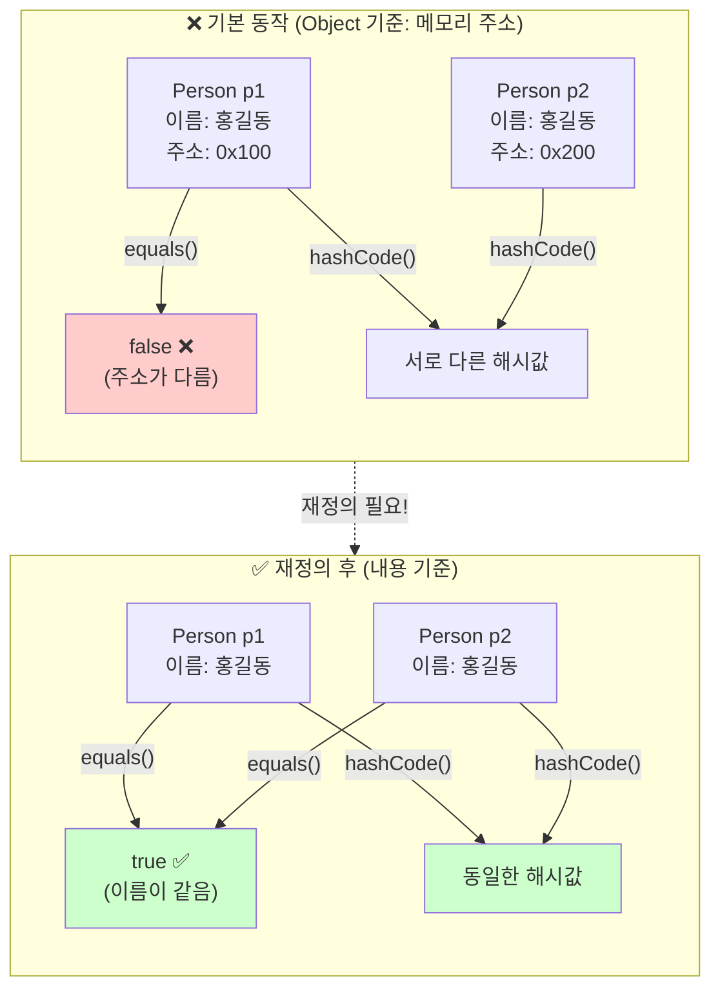
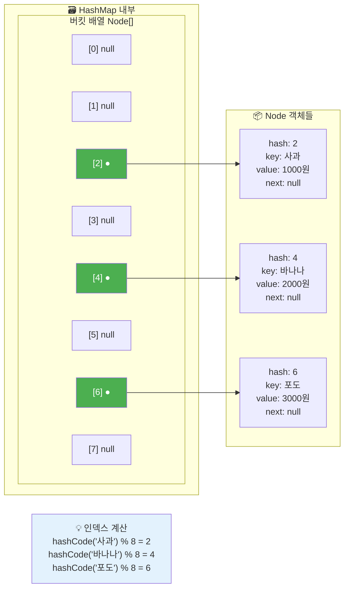
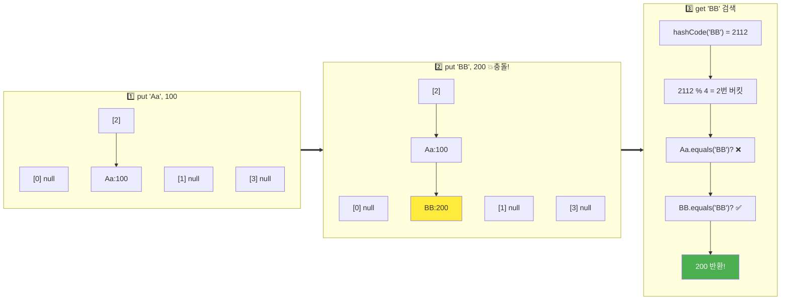
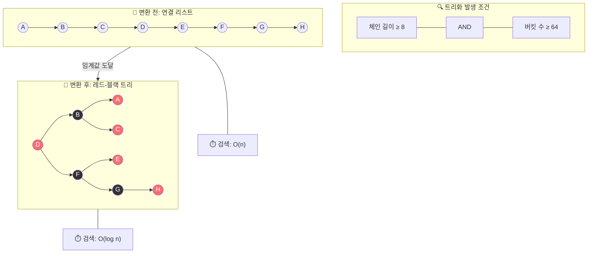
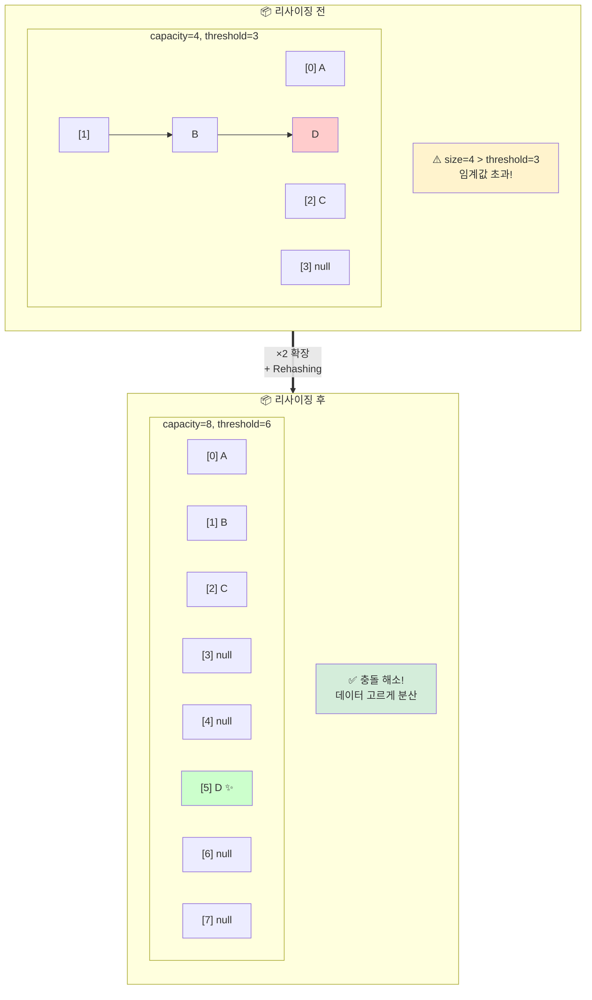
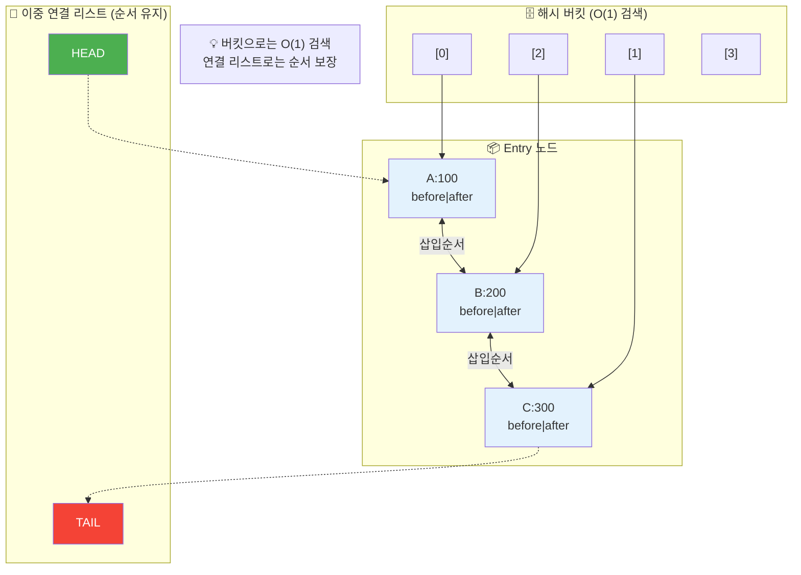
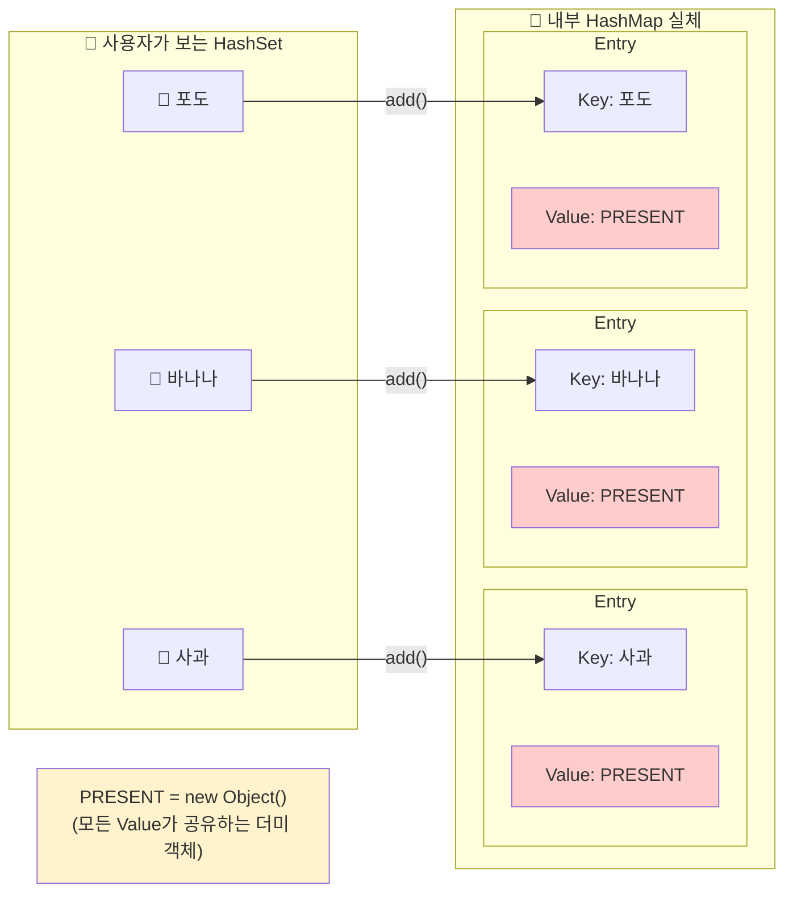

# 📑 Phase 3: 해시(Hash) 자료구조

---

## 📚 목차

| 번호 | 주제 | 핵심 키워드 |
|:---:|------|------------|
| 1 | [해시의 본질](#1-해시의-본질) | 해시 함수, O(1) 검색, 결정적/균등 분포 |
| 2 | [hashCode()와 equals()의 관계](#2-hashcode와-equals의-관계) | 계약(Contract), 반쪽짜리 재정의 위험 |
| 3 | [HashMap 내부 구조](#3-hashmap-내부-구조) | 버킷, Node, 체이닝 |
| 4 | [해시 충돌](#4-해시-충돌) | Separate Chaining, Open Addressing |
| 5 | [트리화 (Treeify)](#5-트리화-treeify) | Red-Black Tree, 임계값 8/6, Hash DoS |
| 6 | [리사이징 (Resizing)](#6-리사이징-resizing) | Load Factor 0.75, Rehashing, 2의 거듭제곱 |
| 7 | [LinkedHashMap](#7-linkedhashmap) | 이중 연결 리스트, LRU 캐시, 접근 순서 |
| 8 | [HashSet](#8-hashset) | HashMap 래퍼, Dummy Object, Set 선택 기준 |

---

## 1. 해시의 본질

> ### 📌 핵심 질문: "해시 함수란 무엇인가?"

### 🏠 Conceptual Essence

지금까지 우리가 배운 자료구조에서 특정 데이터를 찾으려면 어떤 노력을 했을까? `ArrayList`는 처음부터 끝까지 하나씩 뒤지는 **$O(n)$** 의 노력이 필요했다. 정렬을 잘 해둬야 겨우 **$O(\log n)$** 으로 줄일 수 있었다.

그런데 데이터가 100만 개든 1억 개든 상관없이 단 한 번에($O(1)$) 찾을 수 있는 방법이 있다면 어떨까? 그게 바로 **해시(Hash)** 의 마법이다.

**해시 함수(Hash Function)** 는 임의의 데이터를 고정된 크기의 숫자로 변환하는 마법의 상자다.

- "홍길동"을 넣으면 → 42
- "이순신"을 넣으면 → 137

이 숫자를 해시값(Hash Value) 또는 **해시코드(HashCode)** 라고 부른다. 이 숫자가 왜 대단한가? 이걸 배열의 인덱스로 바로 써먹을 수 있기 때문이다. "홍길동"을 저장할 때 42번 인덱스에 넣어두고, 찾을 때도 다시 계산해서 42번으로 직행하면 된다. 검색이 아니라 계산으로 위치를 알아내는 것이다.

### 🔍 Deep Dive

해시 함수가 제 역할을 하려면 3가지 철칙을 지켜야 한다.

### 1. 결정적(Deterministic)

같은 입력에는 무조건 같은 출력이 나와야 한다. 어제는 42였다가 오늘은 43이 나오면 저장한 데이터를 영영 찾을 수 없다.

### 2. 균등 분포(Uniform Distribution)

서로 다른 입력들이 배열 여기저기에 골고루 퍼져야 한다. 모든 데이터가 42번 인덱스로만 몰리면, 그건 배열이 아니라 그냥 줄 세우기가 되어버린다($O(n)$).

### 3. 빠른 속도

위치를 계산하는 시간이 데이터를 하나씩 비교하는 시간보다 길면 아무 의미가 없다.

### 해시 함수의 시각화



---

## 2. hashCode()와 equals()의 관계

> ### 📌 핵심 질문: "왜 둘을 함께 재정의해야 하는가?"

### 🏠 Conceptual Essence

자바의 모든 객체는 `Object`로부터 `hashCode()`와 `equals()`를 물려받는다. `HashMap`이나 `HashSet` 같은 해시 기반 자료구조들은 이 두 메서드를 콤비로 사용해서 데이터를 관리한다.

**`hashCode()`**: 객체의 "지번 주소"를 계산한다. 이 값을 보고 어느 박스(버킷)에 데이터를 넣을지 결정한다.

**`equals()`**: 그 박스 안에 있는 데이터가 "진짜 내가 찾는 그놈"인지 확인한다.

이 둘 사이에는 **"같으면 주소도 같아야 한다"** 는 엄격한 계약(Contract)이 존재한다. 만약 `equals()`가 `true`인데 `hashCode()`가 다르다면, `HashMap`은 엉뚱한 동네(버킷)를 뒤지다가 "데이터가 없네?"라며 포기해버린다.

### 🔍 Deep Dive

### 기본 동작 vs 재정의 동작



### 재정의의 핵심 규칙

`equals()`에서 "우리는 이름과 나이가 같으면 같은 사람이다"라고 정의했다면, `hashCode()`도 반드시 이름과 나이를 재료로 해시값을 만들어야 한다. 그래야 같은 해시 결과가 나오고, 같은 버킷에 도달할 수 있기 때문이다.

### 💡 Mentor's Advice

### 1. 반쪽짜리 재정의의 위험성

`equals()`만 재정의하고 `hashCode()`를 내버려 두면, 논리적으로는 같은 객체인데 `HashMap`에 넣었을 때 실종되는 버그가 생긴다. 저장할 때 주소와 찾을 때 주소가 다르기 때문이다.

### 2. hashCode()만 재정의할 경우

해시 충돌이 났을 때 `equals()`가 주소값만 비교하므로, 내용이 같아도 "너 아까 걔 아니지?"라고 부정당하게 된다. 결국 데이터 중복 저장이 발생한다.

### 3. IDE의 도움을 받아라

이 로직은 사람이 짜다가 필드 하나만 빼먹어도 치명적이다. IntelliJ나 Eclipse의 자동 생성(Generate) 기능을 쓰거나, **Lombok의 `@EqualsAndHashCode`** 를 활용하는 것이 실무에서 가장 안전한 방법이다.

---

## 3. HashMap 내부 구조

> ### 📌 핵심 질문: "버킷과 체이닝이란 무엇인가?"

### 🏠 Conceptual Essence

`HashMap`의 실체는 사실 Node 객체들의 배열이다. 이 배열의 한 칸 한 칸을 **버킷(Bucket)** 이라고 부른다. 우리가 데이터를 넣을 때, 내부적으로는 다음과 같은 마법이 일어난다.

### 데이터 저장 과정

**1단계**: 키(Key)의 `hashCode()`를 호출해서 정수값을 얻는다.

**2단계**: 이 값을 배열의 크기(보통 16으로 시작)로 나누어 인덱스를 계산한다. (예: `12345678 % 16 = 14`)

**3단계**: 계산된 인덱스 번호의 버킷에 데이터를 쏙 집어넣는다.

찾을 때도 똑같은 계산을 해서 해당 인덱스로 직행하기 때문에 데이터가 아무리 많아도 **$O(1)$** 의 속도가 나오는 것이다.

### 🔍 Deep Dive

### HashMap 구조 시각화



### Node 클래스의 비밀

각 버킷에 저장되는 `Node`는 단순히 키와 값만 들고 있는 게 아니다.

```java
// HashMap 내부의 Node 클래스 (단순화)
static class Node<K, V> {
    final int hash;    // 해시값 (캐싱해둠)
    final K key;       // 키
    V value;           // 값
    Node<K, V> next;   // 다음 노드 (충돌 시 사용)
}
```

**hash**: 계산된 해시값을 저장해둔다. (다시 계산 안 하려고!)

**key / value**: 우리가 넣은 실제 데이터다.

**next**: 이게 핵심이다. 해시 충돌(서로 다른 키가 같은 인덱스로 배정됨)이 발생했을 때, 같은 버킷 안에서 데이터들을 연결 리스트(Linked List) 형태로 줄 세우기 위해 사용한다. 이 기법을 **체이닝(Chaining)** 이라고 부른다.

---

## 4. 해시 충돌

> ### 📌 핵심 질문: "충돌은 왜 발생하고 어떻게 해결하는가?"

### 🏠 Conceptual Essence

해시 충돌은 수학적으로 피할 수 없는 숙명이다. 이유는 간단하다. `hashCode()`가 반환하는 `int` 범위는 약 42억 개나 되지만, 우리가 실제로 사용하는 배열(버킷) 크기는 보통 16, 32처럼 아주 작기 때문이다. 42억 개의 가능성을 단 16칸에 우겨넣으려니 당연히 겹칠 수밖에 없다.

심지어 서로 다른 문자열이 애초에 같은 `hashCode()`를 반환하는 경우도 있다.

```java
System.out.println("Aa".hashCode());  // 2112
System.out.println("BB".hashCode());  // 2112
```

이렇게 충돌이 났을 때 해결하는 방법은 크게 두 가지다.

### 1. 체이닝(Chaining)

같은 버킷에 여러 노드를 연결 리스트로 줄 세우는 방식이다. 자바의 `HashMap`이 선택한 방식이다.

### 2. 오픈 어드레싱(Open Addressing)

충돌이 나면 옆집(빈 버킷)을 찾아가는 방식이다. 자바에서는 기본적으로 사용하지 않는다.

### 🔍 Deep Dive

### 체이닝 동작 과정 시각화

"Aa"와 "BB"가 같은 해시값을 가져서 2번 버킷에 동시에 들어가려는 상황이다.



### hashCode()와 equals()의 콤비 플레이

여기서 왜 두 메서드가 다 필요한지 명확해진다.

**`hashCode()`**: "어느 버킷(동네)으로 갈까?"를 정한다. (2번 버킷!)

**`equals()`**: "줄 서 있는 놈들 중에 진짜 네가 누구냐?"를 확인한다. (Aa야? BB야?)

### 문제점: 성능 저하

만약 운이 나빠서 모든 키가 같은 버킷에 몰려 체인이 너무 길어지면, 데이터를 찾을 때 리스트를 다 뒤져야 하므로 성능이 **$O(n)$** 으로 떡락한다.

---

## 5. 트리화 (Treeify)

> ### 📌 핵심 질문: "왜 Java 8에서 트리화를 도입했는가?"

### 🏠 Conceptual Essence

Java 8 이전에는 해시 충돌이 발생하면 무조건 연결 리스트로 줄을 세웠다. 하지만 운이 나쁘거나 악의적인 공격으로 인해 체인이 비정상적으로 길어지면 검색 성능이 **$O(n)$** 까지 떨어지는 치명적인 약점이 있었다.

Java 8부터는 이 체인의 길이를 감시하다가 일정 수준을 넘어서면 연결 리스트를 **레드-블랙 트리(Red-Black Tree)** 로 통째로 바꾼다. 트리는 검색 성능이 **$O(\log n)$** 이므로, 데이터가 아무리 꼬여도 최소한의 성능을 보장하겠다는 의지다.

구체적인 숫자를 기억해라. 체인 길이가 8 이상이 되면 트리로 변환하고, 데이터가 삭제되어 6 이하로 줄어들면 다시 가벼운 연결 리스트로 되돌린다. 7이 아닌 6인 이유는 8과 6 사이에 여유를 두어, 데이터 하나가 들어오고 나갈 때마다 리스트와 트리를 계속 왔다 갔다 하는 낭비(Thrashing)를 막기 위해서다.

### 🔍 Deep Dive

### 트리화의 조건과 구조 변화

단순히 체인 길이만 길다고 무조건 나무를 심지는 않는다. 전체적인 집(버킷)의 크기도 고려한다.



만약 체인 길이는 8인데 전체 버킷 수가 64보다 작다면? 자바는 트리로 바꾸는 대신 **리사이징(Resizing)** 을 선택한다. 버킷 개수를 두 배로 늘려서 데이터들을 더 넓게 퍼뜨리는 게 메모리 효율 면에서 더 유리하기 때문이다.

### 💡 Mentor's Advice

### 1. Hash DoS 공격 방어

공격자가 일부러 해시 충돌이 발생하는 키값만 수천 개씩 던져서 서버를 마비시키는 공격이 있었다. 트리화는 이런 최악의 상황에서도 서버가 뻗지 않게 해주는 보안 안전장치다.

### 2. 드문 발생

정상적인 해시 함수를 쓰고 있다면 체인 길이가 8까지 갈 확률은 수학적으로 매우 희박하다. 트리화는 평소 성능을 위한 게 아니라 **"만약의 사태를 대비한 보험"** 이다.

### 3. 메모리 비용

트리의 노드는 연결 리스트의 노드보다 약 2배 정도 메모리를 더 많이 사용한다. 그래서 자바는 가능하면 리스트를 유지하려 하고, 6개 이하로 줄면 즉시 리스트로 원복하는 것이다.

---

## 6. 리사이징 (Resizing)

> ### 📌 핵심 질문: "언제, 어떻게 HashMap이 확장되는가?"

### 🏠 Conceptual Essence

`HashMap`에는 **load factor(부하 계수)** 라는 개념이 있다. 기본값은 0.75다. 이 값은 "버킷이 얼마나 차면 집을 넓힐 것인가(리사이징)"를 결정하는 기준이다.

내부적으로는 **threshold(임계값)** 라는 변수를 관리하는데, 이는 `capacity × loadFactor`로 계산된다. 예를 들어 기본 용량(capacity)이 16이고 부하 계수가 0.75라면 임계값은 12다. 즉, 데이터가 12개를 넘는 순간 `HashMap`은 "좁다!"고 판단하고 배열 크기를 키운다.

왜 100%를 다 채우지 않을까? 버킷이 꽉 찰수록 해시 충돌 확률이 기하급수적으로 올라가기 때문이다. 0.75는 성능(속도)과 메모리 효율 사이의 가장 이상적인 균형점이다.

### 🔍 Deep Dive

### 리사이징과 재해싱(Rehashing) 시각화

리사이징이 발생하면 단순히 배열만 커지는 게 아니다. 모든 데이터의 위치를 다시 계산해서 옮겨야 한다. 인덱스 계산 공식인 `hashCode & (length - 1)`에서 `length`가 바뀌면 결과값도 달라지기 때문이다.



### 2의 거듭제곱의 비밀

`HashMap`의 크기는 항상 16, 32, 64처럼 2의 거듭제곱으로 늘어난다. 이유는 나눗셈 연산(`%`)보다 훨씬 빠른 **비트 연산(`&`)** 을 쓰기 위해서다. `hashCode & (length - 1)` 공식을 쓰려면 반드시 크기가 2의 거듭제곱이어야만 한다.

### 💻 Example Code

데이터가 많을 것이 예상된다면, 초기 용량을 설정해서 리사이징 횟수를 줄이는 것이 성능에 큰 도움이 된다. 리사이징은 모든 데이터를 다시 배치하는 $O(n)$의 비싼 연산이기 때문이다.

```java
// 1000개를 넣을 예정이라면
// 1000 / 0.75 = 1333.33... → 최소 1334 필요
// 2의 거듭제곱으로 올리면 2048이 적절함
Map<String, Integer> map = new HashMap<>(2048);

// 또는 간단히 예상 크기만 넣어도 
// HashMap이 내부적으로 부하 계수를 고려해 적절한 2의 거듭제곱 크기를 잡음
Map<String, Integer> map2 = new HashMap<>(1000);
```

### 💡 Mentor's Advice

### 1. 초기 용량의 중요성

`ArrayList`와 마찬가지로 대량의 데이터를 다룰 때는 미리 공간을 확보해라. 리사이징이 일어날 때마다 CPU는 노가다(재해싱)를 해야 한다.

### 2. 부하 계수는 건드리지 마

0.75는 자바 엔지니어들이 수많은 테스트 끝에 찾아낸 최적값이다. 특별한 이유가 없다면 기본값을 믿고 써라.

---

## 7. LinkedHashMap

> ### 📌 핵심 질문: "순서를 유지하는 HashMap은 어떻게 동작하는가?"

### 🏠 Conceptual Essence

`HashMap`은 입력 순서를 전혀 보장하지 않는다. 내부적으로 해시값에 따라 데이터를 여기저기 버킷에 흩어놓기 때문이다. 하지만 실무에서는 **"데이터를 넣은 순서"** 나 **"최근에 사용한 순서"** 가 중요할 때가 많다. 이때 사용하는 것이 바로 `LinkedHashMap`이다.

`LinkedHashMap`은 `HashMap`을 상속받아 그 기능을 그대로 쓰면서, 한 가지 마법을 더했다. 바로 모든 엔트리(Node)를 **이중 연결 리스트(Doubly Linked List)** 로 줄 세우는 것이다. 즉, 해시 버킷 안에 데이터가 저장됨과 동시에, 각 데이터는 "내 앞에 들어온 놈"과 "내 뒤에 들어온 놈"의 손을 잡고 있다.

이 덕분에 `HashMap`의 강점인 $O(1)$ 검색 성능을 누리면서도, 순회할 때는 연결 리스트만 따라가면 입력 순서를 완벽하게 재현할 수 있다.

### 🔍 Deep Dive

### LinkedHashMap의 하이브리드 구조

해시 버킷은 위치를 찾을 때 쓰고, 연결 리스트는 순서를 지킬 때 쓴다.



### 두 가지 순서 모드

### 1. 삽입 순서 (Insertion-order)

기본값이다. 데이터를 `put`한 순서대로 유지한다.

### 2. 접근 순서 (Access-order)

`get`이나 `put`으로 데이터를 건드리면, 해당 데이터를 리스트의 맨 뒤로 보낸다. 즉, **"가장 최근에 쓴 놈"** 이 맨 뒤에 서게 된다.

### 💻 Example Code: LRU 캐시 구현

접근 순서 모드를 활용하면 가장 오랫동안 사용하지 않은 항목을 버리는 LRU(Least Recently Used) 캐시를 단 몇 줄로 만들 수 있다.

```java
// LRU 캐시 구현
public class LRUCache<K, V> extends LinkedHashMap<K, V> {
    private final int maxSize;

    public LRUCache(int maxSize) {
        // 세 번째 인자인 accessOrder를 true로 설정
        super(16, 0.75f, true);
        this.maxSize = maxSize;
    }

    @Override
    protected boolean removeEldestEntry(Map.Entry<K, V> eldest) {
        // 전체 크기가 maxSize를 넘어가면 가장 오래된(맨 앞의) 항목을 자동 삭제
        return size() > maxSize;
    }
}

// 사용 예시
LRUCache<String, String> cache = new LRUCache<>(3);
cache.put("A", "1");
cache.put("B", "2");
cache.put("C", "3");
cache.get("A");      // A를 사용함 -> A가 맨 뒤로 이동
cache.put("D", "4"); // 용량 초과 -> 가장 오래된 B가 삭제됨
// 결과 순서: C, A, D
```

### 💡 Mentor's Advice

### 1. 메모리 비용

각 노드마다 `before`, `after` 포인터 2개가 추가되므로 `HashMap`보다는 메모리를 조금 더 쓴다. 하지만 순서가 필요한 상황이라면 그 비용을 지불할 가치가 충분하다.

### 2. 성능

검색과 삽입 성능은 `HashMap`과 거의 같다($O(1)$). 다만 링크를 연결하는 아주 미세한 작업이 추가될 뿐이다.

### 3. 언제 쓰는가

순서가 중요하면 `LinkedHashMap`, 순서 상관없이 가벼운 게 좋으면 `HashMap`을 써라.

---

## 8. HashSet

> ### 📌 핵심 질문: "Set은 내부적으로 어떻게 구현되어 있는가?"

### 🏠 Conceptual Essence

`HashSet`은 중복을 허용하지 않고 순서를 보장하지 않는 집합 자료구조다. 그런데 이 녀석의 정체를 까보면 아주 놀라운 사실이 숨겨져 있다. `HashSet`은 사실 `HashMap`의 껍데기일 뿐이다.

`HashSet` 객체를 생성하면 내부적으로는 `HashMap` 인스턴스가 하나 만들어진다. 우리가 `set.add("A")`를 호출하면, `HashSet`은 내부의 맵에 `map.put("A", PRESENT)`와 같은 식으로 데이터를 집어넣는다. 여기서 `PRESENT`는 그냥 자리를 채우기 위한 가짜 객체(Dummy Object)다.

결국 Set의 중복 방지 원리는 Map의 Key가 중복될 수 없다는 성질을 그대로 이용한 것이다.

### 🔍 Deep Dive

### HashSet의 내부 동작 시각화

우리가 보는 `HashSet`의 모습과 실제 내부에서 돌아가는 `HashMap`의 관계를 보자.



### 왜 굳이 Map을 가져다 썼을까?

### 1. 코드 재사용

이미 완벽하게 검증된 `HashMap`의 해시 알고리즘, 리사이징, 트리화 로직을 그대로 쓸 수 있다.

### 2. 성능

`HashMap`의 키 검색 성능이 **$O(1)$** 이므로, `HashSet`의 데이터 존재 확인(`contains`) 성능도 자연스럽게 **$O(1)$** 이 된다.

### 💡 Mentor's Advice

### 1. 중복 체크의 핵심

`HashSet`에 객체를 넣을 때도 `Phase 3-1-2`에서 배운 **`hashCode()`와 `equals()`** 가 결정적인 역할을 한다. 이 두 메서드가 제대로 재정의되어 있지 않으면, 내용이 같은 객체라도 중복으로 저장되는 대참사가 발생한다.

### 2. 순서가 필요하다면?

`HashSet`은 순서를 무시한다. 만약 입력 순서를 지키고 싶은 Set이 필요하다면, `LinkedHashMap`을 내부적으로 사용하는 **`LinkedHashSet`** 을 쓰면 된다.

### 3. Value는 낭비인가?

`HashMap`의 Value 자리에 의미 없는 더미 객체를 계속 넣으므로 메모리 낭비라고 생각할 수 있지만, 안정성과 코드 관리 측면에서의 이득이 훨씬 크기 때문에 자바는 이 구조를 선택했다.

### 💡 Set 구현체 선택 기준

집합(Set)이 필요할 때 어떤 도구를 꺼낼지는 네가 필요한 **'순서'** 가 무엇인지에 따라 결정된다.

### 1. HashSet (기본값)

순서가 상관없다면 무조건 이 녀석이다. 가장 빠르고 가볍다.

### 2. LinkedHashSet

"넣은 순서대로" 나와야 할 때 쓴다. `LinkedHashMap` 덕분에 성능과 순서를 모두 잡았다.

### 3. TreeSet

"값의 크기순(오름차순/내림차순)"으로 정렬이 필요할 때 쓴다. 내부적으로 이진 탐색 트리(`TreeMap`)를 써서 성능은 $O(\log n)$으로 살짝 느리지만, 늘 정렬된 상태를 유지한다.

---

## 🎯 Phase 3 핵심 요약

해시 자료구조의 마법을 다시 한번 복습해보자.

**해시의 본질**: 계산 한 번으로 위치를 찾는 **$O(1)$** 의 검색 혁명이다.

**객체 간의 약속**: `hashCode()`는 주소(버킷)를 정하고, `equals()`는 그 주소의 주인을 확인한다. "둘은 운명 공동체다."

**HashMap 엔진**: 버킷 배열, 체이닝($O(n)$), 그리고 최후의 보루인 트리화($O(\log n)$)로 이어지는 3단계 방어선을 구축하고 있다.

**성장 전략**: `load factor 0.75`가 넘으면 집을 2배로 넓히는 리사이징을 수행한다.

**변주**: 순서를 기억하면 `LinkedHashMap`, 값만 챙기면 `HashSet`이 된다.
