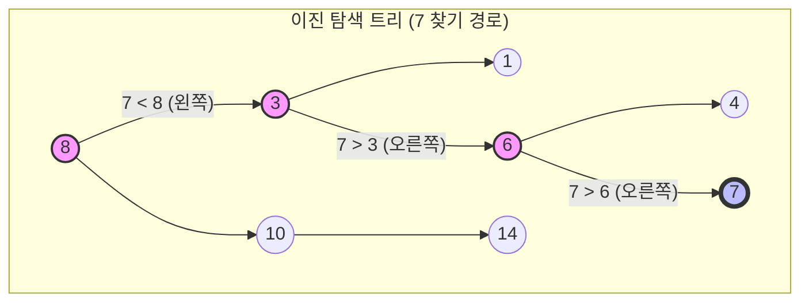
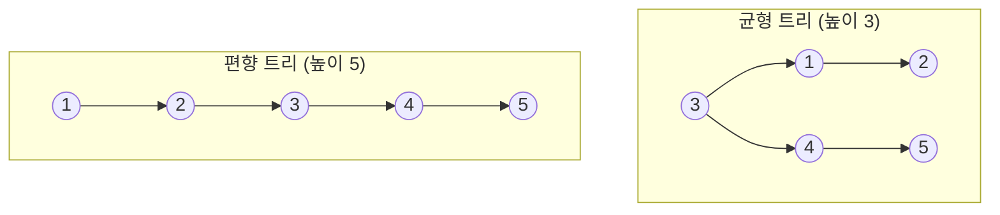
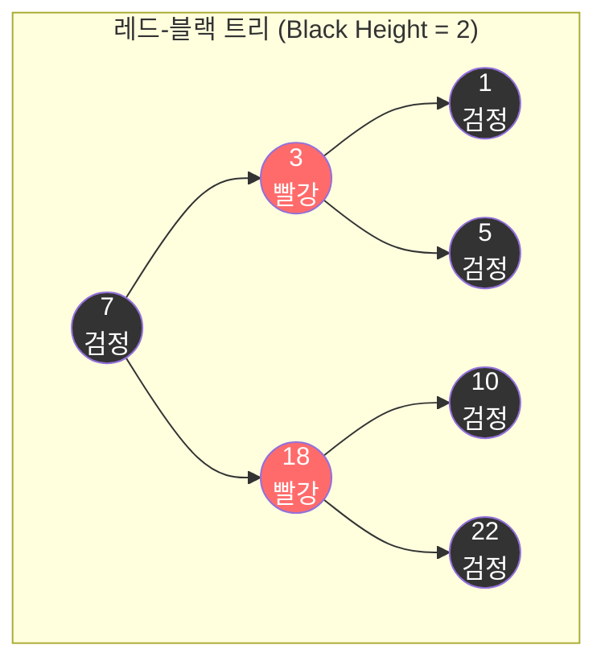
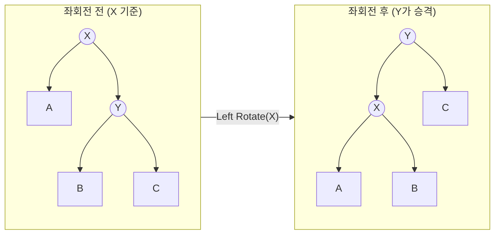
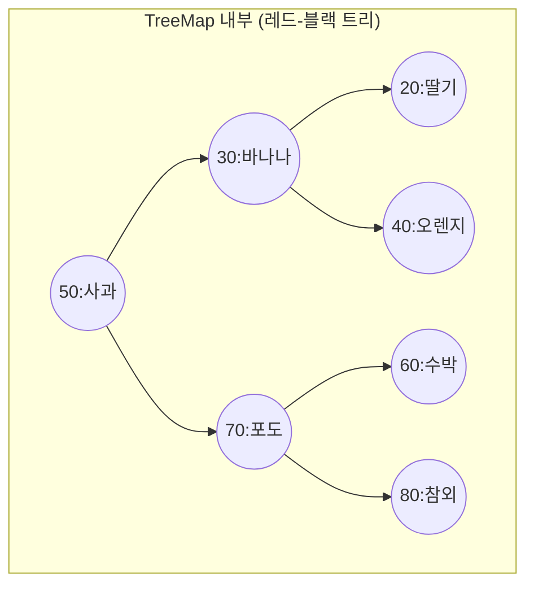
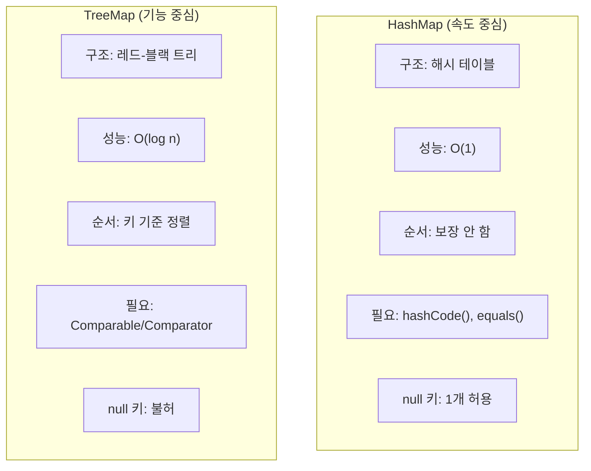

# 📑 Phase 4: 트리와 정렬

## 1. 이진 탐색 트리의 본질

> ### 📌 핵심 질문: "트리 구조가 왜 검색에 유리한가?"

### 🏠 Conceptual Essence

데이터를 찾는 가장 원시적인 방법은 처음부터 끝까지 다 뒤지는 **선형 탐색($O(n)$)** 이다. 하지만 데이터가 정렬되어 있다면 중간값과 비교하며 범위를 절반씩 쳐내는 **이진 탐색($O(\log n)$)** 이 가능하다.

**이진 탐색 트리(Binary Search Tree, BST)** 는 이 '절반씩 버리는 효율성'을 아예 데이터 구조 자체로 박아버린 녀석이다. 규칙은 단 하나다.

**"왼쪽 자식은 나보다 작고, 오른쪽 자식은 나보다 크다."**

이 규칙 덕분에 우리는 루트에서 시작해 한 번 비교할 때마다 가야 할 길을 정하고, 반대편 길에 있는 수많은 데이터는 쳐다보지도 않아도 된다. 배열의 이진 탐색과 원리는 같지만, 배열과 달리 새로운 데이터를 삽입하거나 삭제할 때 다른 요소들을 밀고 당길 필요가 없다는 게 엄청난 장점이다.

### 🔍 Deep Dive

### BST 구조 시각화

루트 노드 8을 기준으로 7을 찾아가는 과정을 그려보자.



### 탐색 과정

**1단계**: 8과 비교 → 7이 더 작으니 왼쪽으로 간다.

**2단계**: 3과 비교 → 7이 더 크니 오른쪽으로 간다.

**3단계**: 6과 비교 → 7이 더 크니 오른쪽으로 간다.

**4단계**: 7 발견!

데이터가 8개인데 단 4번 만에 찾았다. 전체 데이터가 100만 개여도 이론적으로는 약 20번($\log_2 1,000,000 \approx 20$)의 비교면 충분하다. 트리의 높이를 $h$라고 할 때 시간 복잡도는 **$O(h)$** 다.

### 💻 Example Code

BST의 핵심은 '비교'를 통해 길을 찾아가는 재귀적 혹은 반복적 로직이다.

```java
public class BinarySearchTree<T extends Comparable<T>> {
    private Node<T> root;

    private static class Node<T> {
        T value;
        Node<T> left;
        Node<T> right;
        Node(T value) { this.value = value; }
    }

    // 검색 - 평균 O(log n), 최악 O(n)
    public boolean contains(T value) {
        Node<T> current = root;
        while (current != null) {
            int cmp = value.compareTo(current.value);
            if (cmp < 0) current = current.left;      // 왼쪽 탐색
            else if (cmp > 0) current = current.right; // 오른쪽 탐색
            else return true;                          // 발견!
        }
        return false;
    }

    // 삽입 - 빈 자리를 찾아서 연결
    public void insert(T value) {
        root = insertRecursive(root, value);
    }

    private Node<T> insertRecursive(Node<T> node, T value) {
        if (node == null) return new Node<>(value);
        int cmp = value.compareTo(node.value);
        if (cmp < 0) node.left = insertRecursive(node.left, value);
        else if (cmp > 0) node.right = insertRecursive(node.right, value);
        return node;
    }
}
```

---

## 2. BST의 한계

> ### 📌 핵심 질문: "불균형 트리는 왜 문제인가?"

### 🏠 Conceptual Essence

앞서 배운 BST의 성능 $O(\log n)$은 트리가 균형 있게(Balanced) 자랐을 때만 성립한다. 하지만 BST는 데이터가 들어오는 순서에 따라 모양이 결정된다는 치명적인 단점이 있다.

만약 데이터가 이미 정렬된 상태(예: 1, 2, 3, 4, 5)로 들어오면 어떻게 될까? 1이 루트가 되고, 2는 1의 오른쪽, 3은 2의 오른쪽... 이런 식으로 계속 오른쪽으로만 가지가 뻗어나간다. 이렇게 한쪽으로 쏠린 트리를 **편향 트리(Skewed Tree)** 라고 부른다.

이 상황이 되면 트리의 높이($h$)가 데이터 개수($n$)와 같아진다. 결국 탐색 성능이 **$O(n)$** 으로 떨어지며, 우리가 앞서 배운 `LinkedList`와 다를 바 없는 성능이 되어버린다.

### 🔍 Deep Dive

### 균형 트리 vs 편향 트리 비교

동일한 데이터를 가지고 있어도 입력 순서에 따라 성능 차이가 극명하게 갈린다.



### 비교 분석

### 1. 균형 트리

루트에서 가장 먼 노드까지 가는데 최대 2번만 이동하면 된다. 성능이 안정적이다.

### 2. 편향 트리

사실상 선형 리스트다. 5를 찾으려면 루트부터 모든 노드를 다 거쳐야 한다. 데이터가 100만 개라면 100만 번 비교해야 하는 끔찍한 상황이 벌어진다.

이처럼 **"입력 순서에 운명을 맡겨야 한다"** 는 점 때문에 순수한 BST는 실무에서 거의 쓰이지 않는다.

---

## 3. 레드-블랙 트리 (Red-Black Tree)

> ### 📌 핵심 질문: "레드-블랙 트리는 어떻게 스스로 균형을 잡는가?"

### 🏠 Conceptual Essence

일반적인 BST는 정렬된 데이터가 들어오면 일직선으로 뻗어버리는 편향 문제가 있다. 이를 해결하기 위해 등장한 것이 **레드-블랙 트리(Red-Black Tree)** 다. Java의 `TreeMap`과 `TreeSet`은 이 알고리즘을 사용하여 어떤 순서로 데이터가 들어와도 성능을 **$O(\log n)$** 으로 묶어둔다.

핵심은 **노드에 부여된 색깔(빨강/검정)** 과 그에 따른 5가지 엄격한 규칙이다. 삽입이나 삭제로 인해 이 규칙이 깨지면, 트리는 **회전(Rotation)** 과 색깔 변경을 통해 규칙을 복구한다. 이 과정에서 트리가 한쪽으로 너무 길어지지 않게 스스로의 모양을 다듬는 것이다.

### 🔍 Deep Dive

### 5가지 절대 규칙

**규칙 1**: 모든 노드는 빨강 혹은 검정이다.

**규칙 2**: 루트 노드는 항상 검정이다.

**규칙 3**: 모든 리프(NIL) 노드는 검정이다. (데이터가 없는 끝점)

**규칙 4**: 빨간 노드는 연속될 수 없다. (빨강 자식은 반드시 검정)

**규칙 5**: 루트에서 리프까지의 모든 경로에 있는 검정 노드의 수는 같다. (Black Height)

규칙 4와 5가 결합되면 놀라운 효과가 나타난다. 가장 짧은 경로(전부 검정)와 가장 긴 경로(검정과 빨강이 번갈아 나옴)의 차이가 최대 2배를 넘지 못하게 된다. 즉, 완벽한 대칭은 아니더라도 "적당히 균형 잡힌" 상태가 강제되는 것이다.

### 레드-블랙 트리 구조 시각화



### 회전(Rotation): 구조를 바꾸는 마법

규칙이 깨졌을 때 트리의 높이를 조절하는 핵심 연산이다. BST의 속성(왼쪽 < 부모 < 오른쪽)을 유지하면서 부모와 자식의 위치를 바꾼다.



### 💡 Mentor's Advice

### 1. 복잡한 구현, 단순한 이해

레드-블랙 트리의 삽입/삭제 시 발생하는 수십 가지 케이스를 외울 필요는 없다. 다만, **"규칙 위반 발생 → 색 변경 및 회전 → 균형 복구"** 라는 흐름만 이해하면 충분하다.

### 2. AVL 트리와의 차이

AVL 트리는 훨씬 엄격하게 균형을 맞춰 검색이 더 빠르지만, 삽입/삭제 시 회전이 너무 자주 일어난다. 자바는 삽입/삭제와 검색 성능 사이의 밸런스가 가장 좋은 레드-블랙 트리를 선택했다.

### 3. 실무적 결론

"내가 쓰는 `TreeMap`은 데이터가 아무리 꼬여도 삽입/삭제/검색이 무조건 $O(\log n)$이겠구나!"라는 확신만 가지면 된다.

---

## 4. TreeMap

> ### 📌 핵심 질문: "TreeMap은 어떤 원리로 키를 정렬된 상태로 유지하는가?"

### 🏠 Conceptual Essence

`HashMap`은 해시 함수를 사용해 데이터를 버킷에 흩뿌리기 때문에 순서가 엉망이다. 하지만 `TreeMap`은 레드-블랙 트리라는 자가 균형 이진 탐색 트리를 엔진으로 사용한다. 데이터를 넣을 때마다 크기를 비교해 정해진 자리에 배치하고, 트리가 한쪽으로 쏠리면 회전해서 균형을 맞춘다.

덕분에 `TreeMap`을 순회하면 키가 항상 정렬된 순서로 나온다. 비록 성능은 $O(\log n)$으로 `HashMap`($O(1)$)보다 느리지만, "가장 큰 값 찾기", "특정 범위 데이터만 가져오기" 같은 범위 탐색에서는 독보적인 능력을 발휘한다.

### 🔍 Deep Dive

### TreeMap의 내부 구조

키가 무작위로 삽입되어도 트리는 왼쪽 자식 < 부모 < 오른쪽 자식의 규칙을 지키며 정렬 상태를 유지한다.



### 탐색의 미학: NavigableMap

`TreeMap`은 단순히 정렬만 하는 게 아니라 `NavigableMap` 인터페이스를 구현해서 강력한 탐색 메서드를 제공한다.

**근접값 검색**: 특정 값보다 크거나 작은 가장 가까운 키를 즉시 찾는다. (`floorKey`, `ceilingKey` 등)

**중위 순회(In-order Traversal)**: 왼쪽 → 부모 → 오른쪽 순서로 트리를 읽으면 자연스럽게 오름차순 정렬 결과가 나온다.

**정렬의 조건**: 키는 반드시 `Comparable`을 구현했거나, 생성 시 별도의 `Comparator`를 넘겨줘야 한다. 비교를 못 하면 트리에 자리를 잡을 수 없기 때문이다.

### 💡 Mentor's Advice

### 1. View의 함정

`subMap`, `headMap` 등이 반환하는 것은 새로운 객체가 아니라 원본의 **뷰(View)** 다. 뷰에서 데이터를 지우면 원본에서도 사라지니 주의해라.

### 2. Null 금지

`HashMap`은 `null` 키를 허용하지만, `TreeMap`은 `null` 키를 절대 허용하지 않는다. `null`은 다른 값과 크기를 비교(`compareTo`)할 수 없기 때문이다.

### 3. 성능과 기능의 Trade-off

단순 조회가 목적이면 `HashMap`이 압승이다. 하지만 "80점 이상 90점 이하 학생 목록" 같은 범위 로직이 필요하다면 무조건 `TreeMap`이다.

---

## 5. HashMap vs TreeMap 최종 비교

> ### 📌 핵심 질문: "성능의 HashMap인가, 기능의 TreeMap인가?"

### 🏠 Conceptual Essence

`HashMap`과 `TreeMap`은 같은 `Map` 인터페이스를 구현하지만, 속은 완전히 다른 녀석들이다. 어떤 것이 더 우월한 게 아니라, 네가 해결하려는 문제의 성격에 따라 답이 달라진다.

**HashMap**: 해시 테이블 기반이다. 지번 주소(해시값)로 바로 찾아가니까 **$O(1)$** 로 압도적으로 빠르다. 하지만 데이터가 어디에 박혀있는지 모르니 순서는 엉망이다.

**TreeMap**: 레드-블랙 트리 기반이다. 데이터를 크기순으로 줄 세워 저장한다. 성능은 **$O(\log n)$** 으로 해시보다 느리지만, "가장 작은 놈", "특정 범위"를 찾는 데 특화되어 있다.

선택 기준은 명확하다. "정렬이나 범위 검색이 필요한가?" 필요 없으면 무조건 `HashMap`, 필요하면 `TreeMap`이다.

### 🔍 Deep Dive

### 두 자료구조의 특성 비교



### 기능별 성능 격차

데이터가 많아질수록 두 녀석이 잘하는 분야가 극명하게 갈린다.

| 연산 | HashMap | TreeMap |
|------|---------|---------|
| 특정 키 검색 | $O(1)$ (압승) | $O(\log n)$ |
| 최솟값/최댓값 찾기 | $O(n)$ (전체 순회) | $O(\log n)$ (직행) |
| 범위 검색 (80~90점) | $O(n)$ (전체 순회) | $O(\log n + k)$ (범위만) |
| 정렬된 상태 유지 | 불가 | 항상 유지 |

### 💡 Mentor's Advice

### 1. 실무의 90%는 HashMap이다

단순히 ID로 사용자를 찾거나 키-값 쌍을 저장하는 용도라면 고민 말고 `HashMap`을 써라. 100만 번 조회할 때 1번과 20번의 차이는 무시 못 한다.

### 2. TreeMap이 빛나는 순간

"최근 1시간 이내 로그 보기", "성적 상위 10명 뽑기"처럼 데이터 간의 선후 관계나 범위가 로직의 핵심일 때만 `TreeMap`을 꺼내 들어라.

### 3. 인터페이스 선언의 미학

처음에 `Map<String, String> map = new HashMap<>();`으로 선언해두면, 나중에 정렬이 필요해졌을 때 뒤의 구현체만 `TreeMap`으로 슥 바꿔주면 끝이다. 이게 바로 다형성의 힘이다.

---

## 🎯 Phase 4 트리 자료구조 최종 정리

### 1. 이진 탐색 트리(BST)

"왼쪽 < 부모 < 오른쪽" 원칙으로 검색 효율을 극대화한 나무다. 하지만 편향되면 지팡이($O(n)$)가 된다.

### 2. 레드-블랙 트리

색깔 규칙과 회전을 통해 스스로 균형을 잡는 똑똑한 나무다. 어떤 상황에서도 **$O(\log n)$** 을 보장한다.

### 3. TreeMap

이 강력한 나무를 엔진으로 쓴 맵이다. 정렬, 범위 검색, 근접 값 찾기 등 강력한 탐색 기능을 제공한다.
